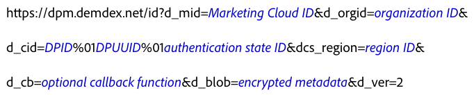

# Integração direta com o Serviço de ID de visitante da Adobe {#direct-integration-with-the-experience-cloud-id-service}

Essa implementação permite que os clientes usem o Serviço de ID do visitante em dispositivos que não podem aceitar ou trabalhar com nosso código JavaScript ou SDK. Isso inclui dispositivos como consoles de jogos, TVs inteligentes ou outros dispositivos habilitados para a Internet. Consulte esta seção para obter sintaxe, exemplos de código e definições.

## Sintaxe {#section-a4754afec5ad40b6be00d6f1011d68bb}

Os dispositivos que não podem usar o `VisitorAPI.js` ou as bibliotecas de código do SDK podem fazer chamadas diretamente para os servidores de coleta de dados (DCS) usados pelo Serviço de ID do Visitante. Para fazer isso, é necessário chamar `dpm.demdex.net` e formatar a solicitação como mostrado abaixo. *Itálico* indica um marcador de posição variável.



Neste exemplo de sintaxe, o `d_` prefixo identifica os pares de valores chave na chamada como uma variável do sistema. Você pode passar alguns parâmetros de `d_` para o Serviço de ID de visitante, mas manter o foco nos pares de valores chave como mostrado no código acima. Para obter mais informações sobre outras variáveis, consulte [Atributos compatíveis para chamadas de API DCS](https://experienceleague.adobe.com/docs/audience-manager/user-guide/api-and-sdk-code/dcs/dcs-api-reference/dcs-keys.html?lang=pt-BR).

O Serviço de ID do visitante oferece suporte a chamadas HTTP e HTTPS. Use HTTPS para enviar dados de uma página segura.

## Exemplo de solicitação {#section-26302b8851704888b6f8e6b2071bcdb0}

Sua solicitação pode ser semelhante à amostra exibida abaixo. Variáveis longas foram encurtadas.


## Exemplo de resposta {#section-89bc103b3e9e4a8b98e74c32897b1200}

O Serviço de ID de visitante retorna dados em um objeto JSON, como mostrado abaixo. A sua resposta pode ser diferente.

```js
{
     "d_mid":"12345",
     "dcs_region":"6",
     "id_sync_ttl":"604800",
     "d_blob":"wxyz5432"
}
```

## Parâmetros de solicitação e resposta definidos {#section-4a9912b545364dc4acad4f1ea5ec641d}

**Parâmetros da solicitação**

<table id="table_C8FFA89AB74E4E31A6926CDE5CD54217"> 
 <thead> 
  <tr> 
   <th colname="col1" class="entry"> Parâmetro </th> 
   <th colname="col2" class="entry"> Descrição </th> 
  </tr> 
 </thead>
 <tbody> 
  <tr> 
   <td colname="col1"> <p> <span class="codeph"> dpm.demdex.net</span> </p> </td> 
   <td colname="col2"> <p>Um domínio herdado controlado pela <span class="keyword">Adobe</span>. Consulte <a href="https://experienceleague.adobe.com/docs/audience-manager/user-guide/reference/demdex-calls.html?lang=pt-BR" format="https" scope="external">Compreender as chamadas para o domínio Demdex</a>. </p> </td> 
  </tr> 
  <tr> 
   <td colname="col1"> <p> <span class="codeph"> d_mid</span> </p> </td> 
   <td colname="col2"> <p>A ECID. Consulte <a href="../introduction/cookies.md" format="dita" scope="local"> Cookies e o Serviço de ID de Visitante</a>. </p> </td> 
  </tr> 
  <tr> 
   <td colname="col1"> <p> <span class="codeph"> d_orgid</span> </p> </td> 
   <td colname="col2"> <p>Sua ID organizacional IMS. Para obter ajuda para encontrar essa ID, consulte <a href="../reference/requirements.md" format="dita" scope="local"> Requisitos para o Serviço de ID de Visitante</a>. </p> </td> 
  </tr> 
  <tr> 
   <td colname="col1"> <p> <span class="codeph"> d_cid</span> </p> </td> 
   <td colname="col2"> <p>Um parâmetro opcional que passa a ID do Provedor de Dados (DPID), a ID de Usuário Exclusiva (DPUUID) e uma ID de estado autenticada <a href="../reference/authenticated-state.md" format="dita" scope="local"></a> para o Serviço de ID do Visitante. Como mostrado na amostra de código, separe a DPID e a DPUUID com o caractere de controle não imprimível, <span class="codeph">%01</span>. </p> <p> <b>DPID e DPUUID</b> </p> <p>No parâmetro <span class="codeph">d_cid</span>, atribua cada combinação de DPID e DPUUID relacionada ao mesmo parâmetro <span class="codeph">d_cid</span>. Isso permite que você retorne diversos conjuntos de IDs em uma única solicitação. Além disso, separe a DPID, a DPUUID e o sinalizador de autenticação opcional com o caractere de controle não imprimível, <span class="codeph">%01</span>. Nos exemplos abaixo, o provedor e as IDs do usuário são destacadas com texto em <b>negrito</b>. </p> 
    <ul id="ul_2E19D837296B40E9ACD096495CF711C5"> 
     <li id="li_5B94B057654440B99B989BA60E4ED053">Sintaxe: <span class="codeph">...d_cid=DPID%01DPUUID%01estado de autenticação...</span> </li> 
     <li id="li_B07833EF51D54F088574B7B7F9FB841A">Exemplo: <span class="codeph">...d_cid=123%01456%011...</span> </li> 
    </ul> <p> <b>Estado de autenticação</b> </p> <p>Essa é uma ID opcional no parâmetro <span class="codeph">d_cid</span>. Expressa como um inteiro, identifica os usuários de acordo com o status de autenticação como mostrado abaixo: </p> 
    <ul id="ul_E2B36922B11C4AA2A9016B6E2DC9EDAA"> 
     <li id="li_31C018E3F9514B938C73EF40C436715F"> <span class="codeph"> 0</span> (Desconhecido) </li> 
     <li id="li_1F125C3879324C2F8EF4613C0ECB5F02"> <span class="codeph"> 1</span> (Autenticado) </li> 
     <li id="li_EF6792D0115D407485079D5D7480D965"> <span class="codeph"> 2</span> (Logout realizado) </li> 
    </ul> <p>Para especificar um estado de autenticação, você define esse sinalizador após a variável da ID de usuário (UUID). Separe a UUID e o sinalizador de autenticação com o caractere de controle não imprimível, <span class="codeph">%01</span>. Nos exemplos abaixo, as IDs de autenticação estão destacadas com texto em <b>negrito</b>. </p> <p>Sintaxe: <span class="codeph">...d_cid=DPID%01DPUUID%01estado de autenticação</span> </p> <p>Exemplos: </p> 
    <ul id="ul_4C1054CE860A4D9C8DD85C2A8020C47F"> 
     <li id="li_AD4000BF3E0146C0BD37B1EC513EC314">Desconhecido: <span class="codeph">...d_cid=123%01456%010...</span> </li> 
     <li id="li_B037D424AADA4D41BF29381A9602AE61">Autenticado: <span class="codeph">...d_cid=123%01456%011...</span> </li> 
     <li id="li_0410FCB9E60D4DD08E7898D814E1C3C9">Logout: <span class="codeph">...d_cid=123%01456%012...</span> </li> 
    </ul> </td> 
  </tr> 
  <tr> 
   <td colname="col1"> <p> <span class="codeph"> dcs_region</span> </p> </td> 
   <td colname="col2"> <p>O Serviço de ID de visitante é um sistema distribuído geograficamente e com balanceamento de carga. A ID identifica a região do data center que manipula a chamada. Consulte <a href="https://experienceleague.adobe.com/docs/audience-manager/user-guide/api-and-sdk-code/dcs/dcs-api-reference/dcs-regions.html?lang=pt-BR" format="https" scope="external">IDs da região do DCS, locais e nomes de host</a>. </p> </td> 
  </tr> 
  <tr> 
   <td colname="col1"> <p> <span class="codeph"> d_cb</span> </p> </td> 
   <td colname="col2"> <p> <i>(Opcional)</i> Um parâmetro de retorno de chamada que permite a você executar uma função do JavaScript no corpo da solicitação. </p> </td> 
  </tr> 
  <tr> 
   <td colname="col1"> <p> <span class="codeph"> d_blob</span> </p> </td> 
   <td colname="col2"> <p>Um pedaço criptografado de metadados JavaScript. As restrições de tamanho limitam o blob a 512 bytes ou menos. </p> </td> 
  </tr> 
  <tr> 
   <td colname="col1"> <p> <span class="codeph"> d_ver</span> </p> </td> 
   <td colname="col2"> <p>Obrigatório. Isso define o número de versão da API. Deixe essa opção configurada como <span class="codeph">d_ver=2</span>. </p> </td> 
  </tr> 
 </tbody> 
</table>

**Parâmetros de resposta**

Alguns parâmetros de resposta fazem parte da solicitação e foram definidos na seção acima.

<table id="table_58D0E8876DDC4A81B1F24F845E87EC18"> 
 <thead> 
  <tr> 
   <th colname="col1" class="entry"> Parâmetro </th> 
   <th colname="col2" class="entry"> Descrição </th> 
  </tr> 
 </thead>
 <tbody> 
  <tr> 
   <td colname="col1"> <p> <span class="codeph"> id_sync_ttl</span> </p> </td> 
   <td colname="col2"> <p>O intervalo de re-sincronização, especificado em segundos. O intervalo padrão é de 604.800 segundos (7 dias). </p> </td> 
  </tr> 
 </tbody> 
</table>

