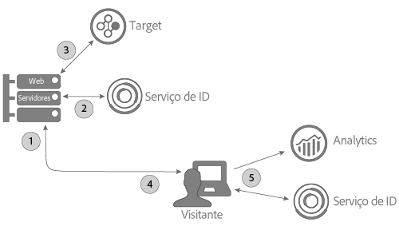

# Uso do Serviço de ID do visitante com A4T e uma implementação do lado do servidor do Target {#using-the-id-service-with-a-t-and-a-server-side-implementation-of-target}

Estas instruções são para clientes da A4T com implementações mistas do lado do servidor e do lado cliente para o Target, o Analytics e o Serviço de ID do visitante. Os clientes que precisam executar o Serviço de ID de visitante em um ambiente NodeJS ou Rhino também devem consultar essas informações. Essa instância do Serviço de ID de Visitante usa uma versão reduzida da biblioteca de códigos do `VisitorAPI.js`, que você pode baixar e instalar no NPM (Gerenciador de Pacotes de Nós). Consulte esta seção para obter instruções de instalação e outros requisitos de configuração.

## Introdução {#section-ab0521ff5bbd44c592c3eaab31c1de8b}

O A4T (e outros clientes) pode usar essa versão do Serviço de ID de visitante quando for necessário:

* Renderize o conteúdo da página da Web em seus servidores e o transmita a um navegador para exibição final.
* Efetuar chamadas do Target do lado do servidor.
* Fazer chamadas do lado do cliente (no navegador) para o Analytics.
* Sincronize IDs separadas do Target e do Analytics para determinar se um visitante visualizado por uma solução é a mesma pessoa visualizada por outra solução.

## Download do código e interfaces fornecidas {#section-32d75561438b4c3dba8861be6557be8a}

Consulte o [repositório NPM do Serviço de ID de Visitante](https://www.npmjs.com/package/@adobe-mcid/visitor-js-server) para baixar o pacote de códigos do lado do servidor e consultar as interfaces incluídas na versão atual.

## Fluxo de trabalho {#section-56b01017922046ed96536404239a272b}

O diagrama e as seções abaixo descrevem o que ocorre e o que é necessário configurar em cada etapa do processo de implementação no lado do servidor.



## Etapa 1: solicitar página {#section-c12e82633bc94e8b8a65747115d0dda8}

A atividade do lado do servidor começa quando um visitante faz uma solicitação HTTP para carregar uma página da Web. Durante essa etapa, o servidor recebe essa solicitação e verifica o [cookie AMCV](../introduction/cookies.md). O cookie AMCV contém a ECID do visitante.

## Etapa 2: gerar carga do Serviço de ID de visitante {#section-c86531863db24bd9a5b761c1a2e0d964}

Em seguida, é necessário criar um *`payload request`* do lado do servidor para o Serviço de ID de visitante. Uma solicitação de carga:

* Passa o cookie AMCV para o Serviço de ID do visitante.
* Solicita dados exigidos pelo Target e Analytics em etapas subsequentes descritas abaixo.

>[!NOTE]
>
>Esse método solicita uma única mbox do Target. Se precisar solicitar várias mboxes em uma única chamada, consulte [generateBatchPayload](https://www.npmjs.com/package/@adobe-mcid/visitor-js-server#generatebatchpayload).

A solicitação de carga deve ser semelhante ao seguinte exemplo de código. No exemplo de código, a função `visitor.setCustomerIDs` é opcional. Consulte [IDs do cliente e Estados de autenticação](../reference/authenticated-state.md) para obter mais informações.

```js
//Import the Visitor ID Service server package 
var Visitor = require("@adobe-mcid/visitor-js-server"); 
 
//Pass in your IMS org ID to instantiate Visitor 
var visitor = new Visitor("Insert ECID here"); 
 
// 
<i>(Optional)</i> Set a custom customer ID 
visitor.setCustomerIDs({ 
     userid:{ 
          id:"1234", 
          authState: Visitor.AuthState.UNKNOWN //AuthState is a static property of the Visitor class 
     } 
}); 
 
//Parse the visitor's HTTP request for the AMCV cookie 
var cookies = cookie.parse(req.headers.cookie || ""); 
var cookieName = visitor.getCookieName(); // Visitor API that returns the cookie name. 
var amcvCookie = cookies[cookieName]; 
 
//Generate the payload request pass your mbox name and the AMCV cookie if present 
var visitorPayload = visitor.generatePayload({ 
     mboxName: "bottom-banner-mbox", 
     amcvCookie: amcvCookie 
});
```

O Serviço de ID de visitante retorna a carga em um objeto JSON semelhante ao exemplo a seguir. Os dados de carga são exigidos pelo Target.

```js
{ 
    "marketingCloudVisitorId": "02111696918527575543455026275721941645", 
    "mboxParameters": { 
        "mboxAAMB": "abcd1234", 
        "mboxMCGLH": "9", 
        "mboxMCSDID": "56BE026543F7E211-1CC51BCAAE88F0D2", 
        "vst.userid.id": "1234567890", 
        "vst.userid.authState": 0 
    } 
}
```

Se o visitante não tiver um cookie AMCV, a carga omite os pares de valores chave abaixo:

* `marketingCloudvisitorId`
* `mboxAAMB`
* `mboxMCGLH`

## Etapa 3: adicionar carga à chamada do Target {#section-62451aa70d2f44ceb9fd0dc2d4f780f7}

Depois que o servidor receber dados de carga do Serviço de ID de visitante, é necessário instanciar mais códigos para mesclá-los aos dados passados ao Target. O objeto JSON final passado para o Target seria semelhante a:

```js
{ 
"mbox" : "target-global-mbox", 
"marketingCloudVisitorId":"02111696918527575543455026275721941645", 
"requestLocation" : { 
     "pageURL" : "http://www.domain.com/test/demo.html", 
     "host" : "localhost:3000" 
     }, 
"mboxParameters" : { 
     "mboxAAMB" : "abcd1234", 
     "mboxMCGLH" : "9", 
     "mboxMCSDID": "56BE026543F7E211-1CC51BCAAE88F0D2", 
     "vst.userid.id": "1234567890", 
     "vst.userid.authState": 0, 
     } 
} 
```

## Etapa 4: obter o estado do servidor para o Serviço de ID de visitante {#section-8ebfd177d42941c1893bfdde6e514280}

Os dados de estado do servidor contêm informações sobre o trabalho concluído no servidor. O código do Serviço de ID de visitante do lado do cliente exige essas informações. Se você configurou o Serviço de ID de visitante por um processo não padrão, será necessário retornar o estado do servidor com seu próprio código. O Serviço de ID de visitante do lado do cliente e o código do Analytics transmitem dados de estado para o Adobe quando a página é carregada.

Se você tiver uma implementação não padrão do Serviço de ID do visitante, é necessário configurar esse código para ser executado no servidor enquanto monta a página solicitada:

```js
//Get server state 
var serverState = visitor.getState(); 
 
Response.send(" 
... 
<head> 
     <script src="VisitorAPI.js"></script> 
     <script> 
          var visitor = Visitor.getInstance(orgID, { 
          serverState: serverState  
          ... 
     </script> 
</head> 
...
```

## Etapa 5: servir uma página e retornar dados do CX Enterprise {#section-4b5631a0d75a41febd6f43f8c214c263}

Nesse ponto, o servidor da Web envia conteúdo da página para o navegador do visitante. A partir desse ponto, o navegador (e não o servidor) faz todas as chamadas restantes do Serviço de ID de visitante e do Analytics. Por exemplo, no navegador:

* O Serviço de ID do visitante recebe dados de estado do servidor e passa a SDID para a AppMeasurement.
* O AppMeasurement envia dados sobre a ocorrência da página para o Analytics, incluindo a SDID.
* O Analytics e o Target comparam SDIDs para esse visitante. Com uma SDID idêntica, o Target e o Analytics unem a chamada do lado do servidor e do lado do cliente. Nesse momento, ambas as soluções agora reconhecem o visitante como a mesma pessoa.

>[!MORELIKETHIS]
>
>* [Pacote de Serviço de ID de Visitante do Lado do Servidor do Gerenciador de Pacote de Nós](https://www.npmjs.com/package/@adobe-mcid/visitor-js-server)

