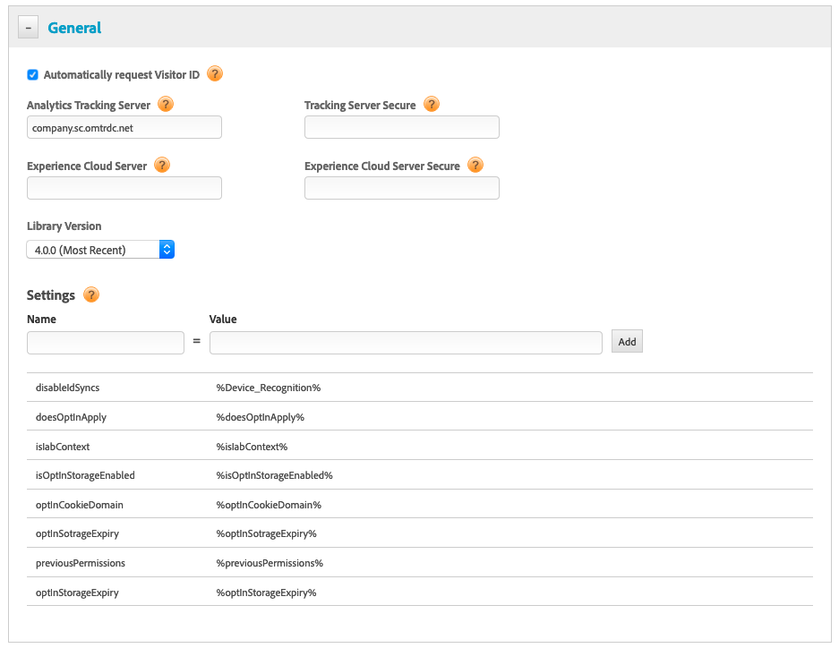

# Configuração do Opt-in com o DTM{#configuring-opt-in-with-dtm}

Habilite o serviço de Opt-in usando o Dynamic Tag Management (DTM).

Defina o serviço de Opt-in usando DTM.

Obrigatório:

* Atualize para a ECID 4.0.0 ou posterior. Consulte [Download da ECID](https://github.com/Adobe-Marketing-Cloud/id-service/releases).

Insira os [campos de configuração](/help/implementation-guides/opt-in-service/api.md) na página DTM geral.

