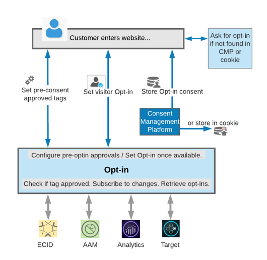

# Serviço de Opt-in{#opt-in-service}

O serviço de aceitação permite configurar os protocolos para o visitante a fim de determinar se você pode adicionar um cookie no dispositivo ou no navegador do usuário quando ele visitar o site.

O serviço de Opt-in é uma extensão da ECID, projetada para permitir que você controle se e quais soluções da CX Enterprise podem criar cookies nas páginas da Web para os visitantes antes do consentimento do usuário. O serviço de Opt-in também permite configurar protocolos para integração com a sua Plataforma de gerenciamento de consentimento (CMP) e sistemas existentes como parte do projeto geral.

Usando o serviço de Opt-in, você pode especificar se um visitante pode aderir às soluções da Adobe de uma só vez ou apresentar as soluções em sequência para fornecer permissões. Quando o processo de aprovação é concluído e registrado pelo cliente, você pode recuperar as aprovações do visitante da CMP para todas as soluções da Adobe.

O serviço de Opt-in é implementado e configurado facilmente usando [tags](https://experienceleague.adobe.com/docs/experience-platform/tags/home.html?lang=pt-BR) com a [Extensão de Opt-in](../../implementation-guides/opt-in-service/launch.md).

Consulte a [Configuração do serviço de Opt-in](../../implementation-guides/opt-in-service/getting-started.md) para começar.

>[!NOTE]
>
>O serviço de Opt-in permite definir um sistema para aprovar ou negar o download dos cookies da Adobe somente. Não fornece suporte para a obtenção das preferência de consentimento do usuário, nem serve como um repositório para as preferências.

>[!IMPORTANT]
>
>O conteúdo deste documento não é um aconselhamento jurídico e não se destina a substituir tal aconselhamento. Consulte o departamento jurídico da sua empresa para obter aconselhamento e práticas para configurar sua implementação de opt-in.

## Opt-in nas soluções corporativas CX {#section-053e6224505542cf961896f0ca869e52}

O serviço de Opt-in é uma ferramenta usada para criar um fluxo de trabalho de adesão ao consentimento de acordo com as suas necessidades e permite projetar um fluxo de trabalho para reagir (disparar tags) antes e depois da obtenção do consentimento do usuário ou do controlador de consentimento.

O serviço de Opt-In permite definir práticas de gerenciamento de consentimento para as soluções da Adobe para:

* Indique se os requisitos de obtenção de consentimento se aplicam em geral a um usuário.
* Especifique quais soluções têm permissão para gerar cookies.
* Aplique as preferências padrão a qualquer solução cuja categoria não seja explicitamente aceita ou recusada pelo usuário.
* Acione a resposta personalizada com base nas alterações das configurações de consentimento de um usuário, permitindo que você persista ou atualize as configurações do usuário.

Usando o serviço de Opt-in, você pode configurar o site para permitir que alguns cookies sejam carregados com pré-consentimento antes da escolha do usuário. Você pode definir serviços de Opt-in para novos clientes para permitir o carregamento de cookies após a obtenção do consentimento do usuário ou após a disponibilização de uma escolha. Você também pode armazenar e recuperar o consentimento de aceitação da sua Plataforma de gerenciamento de consentimento existente ou simplesmente armazenar as permissões de aceitação em um cookie.

As soluções da Adobe podem verificar se a tag foi aprovada, assinar as alterações e recuperar todos os clientes que aderiram. O serviço de Opt-in permite obter as permissões diretamente das bibliotecas JavaScript da solução ou pela ECID, se tiver sido implementada.

