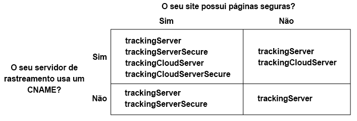

# Implementar o serviço de ID de visitante da Adobe para o Analytics, Audience Manager e Target {#implement-the-experience-cloud-id-service-for-analytics-audience-manager-and-target}

Estas instruções são para clientes do Analytics, Audience Manager e Target que desejam usar o Serviço de ID de visitante e não usam [tags](https://experienceleague.adobe.com/docs/experience-platform/tags/home.html?lang=pt-BR). No entanto, recomendamos que você use tags para implementar o Serviço de ID de visitante. As tags simplificam o fluxo de trabalho de implementação e automaticamente garante o posicionamento e sequenciamento corretos do código.

>[!IMPORTANT]
>
>Leia os [requisitos](../reference/requirements.md) do Serviço de ID de Visitante antes de começar e observe os seguintes requisitos que são específicos desta implementação:
>
>* Os clientes que usam s_code não podem concluir esse procedimento. Atualize para o código da mbox v61 para concluir este procedimento.
>* Configure e teste esse código em um ambiente de desenvolvimento *antes* de implantá-lo na produção.

## Etapa 1: plano de encaminhamento do lado do servidor {#section-880797cc992d4755b29cada7b831f1fc}

Além das etapas descritas, os clientes que usam o Analytics e o Audience Manager devem migrar para o encaminhamento do lado do servidor. O encaminhamento do lado do servidor permite remover o DIL (código de coleta de dados do Audience Manager) e substituí-lo pelo [Módulo de gerenciamento de público-alvo](https://experienceleague.adobe.com/docs/audience-manager/user-guide/implementation-integration-guides/integration-other-solutions/audience-management-module.html?lang=pt-BR). Consulte a [documentação de encaminhamento do lado do servidor](https://experienceleague.adobe.com/docs/analytics/admin/admin-tools/manage-report-suites/edit-report-suite/report-suite-general/server-side-forwarding/ssf.html?lang=pt-BR) para obter mais informações.

A migração para o encaminhamento do lado do servidor requer planejamento e coordenação. Esse processo envolve alterações externas ao código do site e etapas internas que a Adobe deve tomar para provisionar sua conta. Na verdade, muitos desses procedimentos de migração precisam acontecer em paralelo e ser lançados juntos. Seu caminho de implementação deve seguir esta sequência de eventos:

1. Trabalhe com seus contatos do Analytics e do Audience Manager para planejar a migração do Serviço de ID de visitante e do encaminhamento do lado do servidor. A seleção do servidor de rastreamento é uma parte importante do plano.

1. Preencha o formulário no [local de integrações e provisionamento](https://adobe.allegiancetech.com/cgi-bin/qwebcorporate.dll?idx=X8SVES) para começar.

1. Implemente o Serviço de ID de visitante e o Módulo de gerenciamento de público-alvo simultaneamente. Para funcionar adequadamente, o Módulo de Gerenciamento de público-alvo (encaminhamento do lado do servidor) e o Serviço de ID de visitante devem ser lançados para o mesmo conjunto de páginas e ao mesmo tempo.

## Etapa 2: baixar o código do Serviço de ID de visitante {#section-0780126cf43e4ad9b6fc5fe17bb3ef86}

O Serviço de ID de Visitante exige a biblioteca de código `VisitorAPI.js`. Para baixar a biblioteca de código:

1. Vá para **[!UICONTROL Admin > Code Manager]**.
1. No Gerenciador de código, clique em **[!UICONTROL JavaScrpt (New)]** ou **[!UICONTROL JavaScript (Legacy)]**. As bibliotecas de código comprimidas serão baixadas.

1. Descomprima o arquivo de código e abra o `VisitorAPI.js` arquivo.

## Etapa 3: adicionar a função Visitor.getInstance ao código do Serviço de ID de visitante {#section-9e30838b4d0741658a7a492153c49f27}

>[!IMPORTANT]
>
>* As versões anteriores da API de Serviço de ID de visitante colocavam essa função em um local diferente e exigiam uma sintaxe diferente. Se você estiver migrando de uma versão anterior à [versão 1.4](../release-notes/notes-2015.md#section-f5c596f355b14da28f45c798df513572), observe a nova disposição e sintaxe documentadas aqui.
>* O código em ALL CAPS é um espaço reservado para valores reais. Substitua esse texto pela ID da organização IMS, URL do servidor de rastreamento ou outro valor nomeado.

**Parte 1: Copie a função Visitor.getInstance abaixo**

```js
var visitor = Visitor.getInstance("INSERT-IMS-ORG-ID-HERE", { 
     trackingServer: "INSERT-TRACKING-SERVER-HERE", // same as s.trackingServer 
     trackingServerSecure: "INSERT-SECURE-TRACKING-SERVER-HERE", // same as s.trackingServerSecure 
 
     // To enable CNAME support, add the following configuration variables 
     // If you are not using CNAME, DO NOT include these variables 
     marketingCloudServer: "INSERT-TRACKING-SERVER-HERE", 
     marketingCloudServerSecure: "INSERT-SECURE-TRACKING-SERVER-HERE" // same as s.trackingServerSecure 
}); 
```

**Parte 2: Adicionar código de função ao arquivo `VisitorAPI.js`**

Insira a `Visitor.getInstance` função ao final do arquivo, após o bloqueio do código. O arquivo editado deve ficar parecido com o exemplo abaixo:

```js
/* 
========== DO NOT ALTER ANYTHING BELOW THIS LINE ========== 
Version and copyright section 
*/ 
 
// Visitor API code library section 
 
// Put Visitor.getInstance at the end of the file, after the code library 
 
var visitor = Visitor.getInstance("INSERT-IMS-ORG-ID-HERE", { 
     trackingServer: "INSERT-TRACKING-SERVER-HERE", // same as s.trackingServer 
     trackingServerSecure: "INSERT-SECURE-TRACKING-SERVER-HERE", // same as s.trackingServerSecure 
 
     // To enable CNAME support, add the following configuration variables 
     // If you are not using CNAME, DO NOT include these variables 
     marketingCloudServer: "INSERT-TRACKING-SERVER-HERE", 
     marketingCloudServerSecure: "INSERT-SECURE-TRACKING-SERVER-HERE" // same as s.trackingServerSecure 
}); 
```

## Etapa 4: adicionar a ID da organização IMS a Visitor.getInstance {#section-e2947313492546789b0c3b2fc3e897d8}

Na função `Visitor.getInstance`, substitua `INSERT-IMS-ORG-ID-HERE` pela ID da organização IMS. Caso não saiba a ID da organização IMS, é possível encontrá-la na página de administração do CX Enterprise. A função editada pode ser parecida com o exemplo abaixo.

`var visitor = Visitor.getInstance("1234567ABC@AdobeOrg", { ...`

>[!IMPORTANT]
>
>*Não* altere as letras maiúsculas e minúsculas dos caracteres na ID da organização IMS. A ID diferencia maiúsculas e minúsculas e deve ser usada exatamente como foi fornecida.

## Etapa 5: adicionar os servidores de rastreamento ao Visitor.getInstance {#section-0dfc52096ac2427f86045aab9a0e0dfc}

O Analytics usa servidores de rastreamento para coleta de dados.

**Parte 1: encontrar os URLs do servidor de rastreamento**

Verifique os arquivos `s_code.js` ou `AppMeasurement.js` para encontrar os URLs do servidor de rastreamento. Os URLs devem ser especificados pelas variáveis:

* `s.trackingServer`
* `s.trackingServerSecure`

**Parte 2: Definir variáveis do servidor de rastreamento**

Para determinar quais variáveis do servidor de rastreamento usar:

1. Responda às perguntas na matriz de decisão abaixo. Use as variáveis que correspondem às suas respostas.
1. Substitua os espaços reservados do servidor de rastreamento pelos URLs do servidor de rastreamento.
1. Remova o servidor de rastreamento não usado e as variáveis do servidor corporativo CX do código.



>[!NOTE]
>
>Quando usados, associe os URLs do servidor do CX Enterprise aos URLs do servidor de rastreamento correspondentes desta forma:

* URL do servidor corporativo CX = URL do servidor de rastreamento
* URL seguro do servidor corporativo CX = URL seguro do servidor de rastreamento

Caso não tenha certeza de como encontrar o servidor de rastreamento, consulte [Perguntas frequentes](../faq-intro/faq.md) e [Preencher corretamente as variáveis trackingServer e trackingServerSecure](https://helpx.adobe.com/br/analytics/kb/determining-data-center.html#).

## Etapa 6: atualizar o arquivo AppMeasurement.js {#section-5517e94a09bc44dfb492ebca14b43048}

Essa etapa requer o [!UICONTROL AppMeasurement]. Não é possível continuar se você estiver usando o s_code.

Adicione a `Visitor.getInstance` função mostrada abaixo ao `AppMeasurement.js` arquivo. Insira-o na seção que contém configurações, como `linkInternalFilters`, `charSet`, `trackDownloads`, etc.:

`s.visitor = Visitor.getInstance("INSERT-IMS-ORG-ID-HERE");`

>[!IMPORTANT]
>
>Nesse momento, é necessário remover o código DIL do Audience Manager e substituí-lo pelo Módulo de gerenciamento de público-alvo. Consulte [Implementar o encaminhamento do lado do servidor](https://experienceleague.adobe.com/docs/analytics/admin/admin-tools/server-side-forwarding/ssf.html?lang=pt-BR) para obter instruções.

***(Opcional, mas recomendado)* Criar um prop personalizado.**

Definir um prop padrão em `AppMeasurement.js` para medir a cobertura. Adicione este prop personalizado à `doPlugins` função do `AppMeasurement.js` arquivo:

```js
// prop1 is used as an example only. Choose any available prop. 
s.prop1 = (typeof(Visitor) != "undefined" ? "VisitorAPI Present" : "VisitorAPI Missing");
```

## Etapa 7: adicionar o código da API do visitante à página {#section-c2bd096a3e484872a72967b6468d3673}

Insira o `VisitorAPI.js` arquivo nas tags `<head>` de cada página. Ao anexar o `VisitorAPI.js` arquivo à página:

* Coloque-o no início da `<head>` seção para que apareça antes de outras tags de solução.
* É necessário executar antes da AppMeasurement e do código de outras soluções da CX Enterprise.

## Etapa 8: configurar um período de carência (opcional) {#section-aceacdb7d5794f25ac6ff46f82e148e1}

Se algum desses casos de uso se aplicar à sua situação, peça ao [Atendimento ao cliente](https://helpx.adobe.com/br/marketing-cloud/contact-support.html) para configurar um período de carência temporário. Os períodos de carência podem durar até 180 dias. Você pode renovar um período de carência, se necessário.

**Implementação parcial**

Se você tiver páginas que usam o Serviço de ID de visitante e outras que não o usam, é necessário ter um período de carência para que todas sejam relatadas no mesmo conjunto de relatórios do Analytics. Isso é comum se você tiver um conjunto de relatórios global que faz relatórios entre domínios.

Faça a descontinuação do período de carência depois que o Serviço de ID do visitante for implantado em todas as páginas da Web que relatam no mesmo conjunto de relatórios.

**Requisitos de cookie s_vi**

É necessário ter um período de carência se você precisar que os novos visitantes tenham um cookie s_vi após migrar para o Serviço de ID de visitante. Isso é comum se sua implementação ler o cookie s_vi e armazená-lo em uma variável.

A descontinuação do período de carência após a implementação pode capturar a MID em vez de ler o cookie s_vi.

Consulte também [Cookies e o Serviço de ID de visitante](../introduction/cookies.md).

**Integração de dados da sequência de cliques**

É necessário ter um período de carência caso envie dados para um sistema interno de um feed de dados de sequência de cliques que processe os usos das colunas `visid_high` e `visid_low`.

Faça a descontinuação do período de carência se o processo de ingestão de dados conseguir usar as colunas `post_visid_high` e `post_visid_low`.

Consulte também, [Referência da coluna de dados de sequência de cliques](https://experienceleague.adobe.com/docs/analytics/export/analytics-data-feed/data-feed-overview.html?lang=pt-BR).

## Etapa 9: testar e verificar {#section-f857542bfc70496dbb9f318d6b3ae110}

As soluções CX Enterprise nesta implementação retornam IDs na forma de pares de valores-chave. Cada solução usa chaves diferentes (por exemplo, a SDID do Analytics em comparação à mboxMCSDID do Target) para a mesma ID. Para testar a implementação, carregue as páginas em um ambiente de desenvolvimento. Use o console do navegador ou o software que monitora as solicitações e respostas HTTP para verificar as IDs listadas abaixo. O Serviço de ID de visitante foi implementado corretamente quando os pares de valores chave listados abaixo retornam os mesmos valores de ID.

>[!TIP]
>
>Você pode usar o [Adobe Debugger](https://experienceleague.adobe.com/docs/analytics/implementation/validate/debugger.html?lang=pt-BR) ou o [proxy HTTP Charles](https://www.charlesproxy.com/) para verificar essas IDs específicas da solução. Entretanto, você pode usar qualquer ferramenta ou depurador adequado para suas necessidades.

**Todas as soluções**

Verifique:

* [Cookie AMCV](../introduction/cookies.md) no domínio em que a página está hospedada.
* ECID com o Adobe Debugger ou a ferramenta de depuração preferencial.

Para obter verificações adicionais que ajudam a determinar se o Serviço de ID de visitante está funcionando corretamente, consulte [Testar e verificar o Serviço de ID de visitante](../implementation-guides/test-verify.md).

**Analytics**

Verifique o identificador SDID na solicitação do JavaScript. O SDID do Analytics deve corresponder ao mboxMCSDID do Target.

Se os testes retornarem uma AID, isso indica uma destas opções:

* Você é um visitante constante no processo de migração de IDs herdadas do Analytics.
* O [período de carência](https://experienceleague.adobe.com/pt-br/docs/analytics/implementation/id/migration) está habilitado.

Ao observar uma AID, compare o valor com a mboxMCAVID do Target. Esses valores são idênticos quando o Serviço de ID do visitante é implementado corretamente.

**Audience Manager**

Para testar o encaminhamento do lado do servidor, consulte [Como verificar a implementação do encaminhamento do lado do servidor.](https://experienceleague.adobe.com/docs/analytics/admin/admin-tools/server-side-forwarding/ssf-verify.html?lang=pt-BR)

**Target**

Verifique:

* mboxMCGVID
* mboxMCSDID (a mboxMCSDID deve corresponder à SDID do Analytics.)

Se os testes retornarem uma mboxMCAVID, isso indica uma destas opções:

* Você é um visitante constante no processo de migração de IDs herdadas do Analytics.
* O período de carência está habilitado.

Ao observar uma mboxMCAVID, compare o valor à Analytics AID. Esses valores são idênticos quando o Serviço de ID do visitante é implementado corretamente.

**Implantação**

## Etapa 10: implantar {#section-4188fa95e7dc455a986b48a6c517c1c9}

Implante o código depois que ele passar no teste.

Se você habilitou um período de carência:

* Garanta que a ID do Analytics (AID) e a MID estejam presentes na solicitação de imagem.
* Lembre-se de desabilitar o período de carência após atender os [critérios para a descontinuação](../implementation-guides/setup-aam-analytics-target.md#section-aceacdb7d5794f25ac6ff46f82e148e1).

