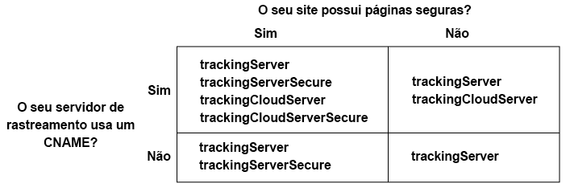

# Implementar o serviço de identidade da Experience Cloud para o Analytics e o Audience Manager {#implement-the-experience-cloud-id-service-for-analytics-and-audience-manager}

Estas instruções são para clientes do Analytics e do Audience Manager que desejam usar o serviço de identidade da Experience Cloud e não usam o Dynamic Tag Management (DTM). No entanto, recomendamos que você use o DTM ao implementar o serviço de ID. O DTM simplifica o fluxo de trabalho de implementação e garante automaticamente a inserção e o sequenciamento corretos do código.

>[!IMPORTANT]
>
>* [Leia as exigências](../reference/requirements.md) antes de começar.
>* Este procedimento requer o AppMeasurement. Os clientes que usam s_code não podem concluir esse procedimento.
>* Configure e teste esse código em um ambiente de desenvolvimento antes de implantá-lo na produção.


## Etapa 1: plano de encaminhamento do lado do servidor {#section-880797cc992d4755b29cada7b831f1fc}

Além das etapas descritas, os clientes que usam o [!DNL Analytics] e o [!DNL Audience Manager] devem migrar para o encaminhamento do lado do servidor. O encaminhamento do lado do servidor permite remover o DIL (código de coleta de dados do Audience Manager) e substituí-lo pelo [Módulo de gerenciamento de público-alvo](https://experienceleague.adobe.com/docs/audience-manager/user-guide/implementation-integration-guides/integration-other-solutions/audience-management-module.html). Consulte a [documentação de encaminhamento do lado do servidor](https://docs.adobe.com/content/help/pt-BR/analytics/admin/admin-tools/server-side-forwarding/ssf.html) para obter mais informações.

A migração para o encaminhamento do lado do servidor requer planejamento e coordenação. Esse processo envolve alterações externas ao código do site e etapas internas que a Adobe deve tomar para provisionar sua conta. Na verdade, muitos desses procedimentos de migração precisam acontecer em paralelo e ser lançados juntos. Seu caminho de implementação deve seguir esta sequência de eventos:

1. Trabalhe com os contatos do [!DNL Analytics] e do [!DNL Audience Manager] a fim de planejar a migração do serviço de ID e do encaminhamento do lado do servidor. A seleção do servidor de rastreamento é uma parte importante do plano.

1. Preencha o formulário no [local de integrações e provisionamento](https://adobe.allegiancetech.com/cgi-bin/qwebcorporate.dll?idx=X8SVES) para começar.

1. Implemente o serviço de ID e o [!DNL Audience Management Module] ao mesmo tempo. Para funcionar adequadamente, o [!DNL Audience Management Module] (encaminhamento do lado do servidor) e o serviço de ID devem ser lançados para o mesmo conjunto de páginas e ao mesmo tempo.

## Etapa 2: baixar o código do serviço de ID {#section-0780126cf43e4ad9b6fc5fe17bb3ef86}

O serviço de ID exige a `VisitorAPI.js` biblioteca de código. Para baixar a biblioteca de código:

1. Acesse **[!UICONTROL Administração]** > **[!UICONTROL Gerenciamento de código]**.

1. No Gerenciamento de código, clique em **[!UICONTROL JavaScript (Novo)]** ou **[!UICONTROL JavaScript (Herdado)]**. As bibliotecas de código comprimidas serão baixadas.

1. Descomprima o arquivo de código e abra o `VisitorAPI.js` arquivo.

## Etapa 3: adicionar a função Visitor.getInstance ao código de serviço de ID {#section-9e30838b4d0741658a7a492153c49f27}

>[!IMPORTANT]
>
>* As versões anteriores da API de serviço de ID colocavam essa função em um local diferente e exigiam uma sintaxe distinta. Se você estiver migrando de uma versão anterior à [versão 1.4](../release-notes/notes-2015.md#section-f5c596f355b14da28f45c798df513572), observe a nova disposição e sintaxe documentadas aqui.
>* O código em ALL CAPS é um espaço reservado para valores reais. Substitua esse texto pela ID da organização, URL do servidor de rastreamento ou outro valor nomeado.


**Parte 1: Copie a função Visitor.getInstance abaixo**

```js
var visitor = Visitor.getInstance("INSERT-MARKETING-CLOUD-ORGANIZATION ID-HERE", { 
     trackingServer: "INSERT-TRACKING-SERVER-HERE", // same as s.trackingServer 
     trackingServerSecure: "INSERT-SECURE-TRACKING-SERVER-HERE", // same as s.trackingServerSecure 
 
     // To enable CNAME support, add the following configuration variables 
     // If you are not using CNAME, DO NOT include these variables 
     marketingCloudServer: "INSERT-TRACKING-SERVER-HERE", 
     marketingCloudServerSecure: "INSERT-SECURE-TRACKING-SERVER-HERE" // same as s.trackingServerSecure 
}); 
```

**Parte 2: Adicionar código de função ao arquivo Visitor API.js**

Insira a `Visitor.getInstance` função ao final do arquivo, após o bloqueio do código. O arquivo editado deve ficar parecido com o exemplo abaixo:

```js
/* 
========== DO NOT ALTER ANYTHING BELOW THIS LINE ========== 
Version and copyright section 
*/ 
 
// Visitor API code library section 
 
// Put Visitor.getInstance at the end of the file, after the code library 
 
var visitor = Visitor.getInstance("INSERT-MARKETING-CLOUD-ORGANIZATION ID-HERE", { 
     trackingServer: "INSERT-TRACKING-SERVER-HERE", // same as s.trackingServer 
     trackingServerSecure: "INSERT-SECURE-TRACKING-SERVER-HERE", // same as s.trackingServerSecure 
 
     // To enable CNAME support, add the following configuration variables 
     // If you are not using CNAME, DO NOT include these variables 
     marketingCloudServer: "INSERT-TRACKING-SERVER-HERE", 
     marketingCloudServerSecure: "INSERT-SECURE-TRACKING-SERVER-HERE" // same as s.trackingServerSecure 
}); 
```

## Etapa 4: adicionar a ID da organização da Experience Cloud à Visitor.getInstance {#section-e2947313492546789b0c3b2fc3e897d8}

Na `Visitor.getInstance` função, substitua `INSERT-MARKETING-CLOUD-ORGANIZATION ID-HERE` pela Experience Cloud ID da organização. Caso não saiba a ID da organização, é possível encontrá-la na página de administração da Experience Cloud. A função editada pode ser parecida com o exemplo abaixo.

`var visitor = Visitor.getInstance("1234567ABC@AdobeOrg", { ...`

>[!IMPORTANT]
>
>*Não* altere a caixa dos caracteres na ID da organização. A ID diferencia maiúsculas e minúsculas e deve ser usada exatamente como foi fornecida.

## Etapa 5: adicionar os servidores de rastreamento ao Visitor.getInstance {#section-0dfc52096ac2427f86045aab9a0e0dfc}

O Analytics usa servidores de rastreamento para coleta de dados.

**Parte 1: encontrar os URLs do servidor de rastreamento**

Verifique os arquivos `s_code.js` ou `AppMeasurement.js` para encontrar os URLs do servidor de rastreamento. Os URLs devem ser especificados pelas variáveis:

* `s.trackingServer`
* `s.trackingServerSecure`

**Parte 2: Definir variáveis do servidor de rastreamento**

Para determinar quais variáveis do servidor de rastreamento usar:

1. Responda às perguntas na matriz de decisão abaixo. Use as variáveis que correspondem às suas respostas.
1. Substitua os espaços reservados do servidor de rastreamento pelos URLs do servidor de rastreamento.
1. Remova o servidor de rastreamento não usado e as variáveis do servidor da Experience Cloud do código.



>[!NOTE]
>
>Quando usados, associe os URLs do servidor da Experience Cloud aos URLs do servidor de rastreamento correspondentes desta forma:

* URL do servidor da Experience Cloud = URL do servidor de rastreamento
* URL seguro do servidor da Experience Cloud = URL seguro do servidor de rastreamento

Caso não tenha certeza de como encontrar o servidor de rastreamento, consulte [Perguntas frequentes](../faq-intro/faq.md) e [Preencher corretamente as variáveis trackingServer e trackingServerSecure](https://helpx.adobe.com/br/analytics/kb/determining-data-center.html#).

## Etapa 6: atualizar o arquivo AppMeasurement.js {#section-5517e94a09bc44dfb492ebca14b43048}

Essa etapa exige o [!UICONTROL AppMeasurement]. Não é possível continuar se você estiver usando o s_code.

Adicione a `Visitor.getInstance` função mostrada abaixo ao `AppMeasurement.js` arquivo. Insira-o na seção que contém configurações, como `linkInternalFilters`, `charSet`, `trackDownloads`, etc.:

`s.visitor = Visitor.getInstance("INSERT-MARKETING-CLOUD-ORGANIZATION ID-HERE");`

>[!IMPORTANT]
>
>Nesse momento, é necessário remover o código [!DNL Audience Manager] DIL do e substituí-lo pelo Módulo de gerenciamento de público-alvo. Consulte [Implementar o encaminhamento do lado do servidor](https://experienceleague.adobe.com/docs/analytics/admin/admin-tools/server-side-forwarding/ssf.html) para obter instruções.

***(Opcional, mas recomendado)* Criar um prop personalizado.**

Definir um prop padrão em `AppMeasurement.js` para medir a cobertura. Adicione este prop personalizado à `doPlugins` função do `AppMeasurement.js` arquivo:

```js
// prop1 is used as an example only. Choose any available prop. 
s.prop1 = (typeof(Visitor) != "undefined" ? "VisitorAPI Present" : "VisitorAPI Missing");
```

## Etapa 7: adicionar o código da API do visitante à página {#section-c2bd096a3e484872a72967b6468d3673}

Insira o ` [!UICONTROL VisitorAPI.js]` arquivo nas tags `<head>` de cada página. Ao anexar o `VisitorAPI.js` arquivo à página:

* Coloque-o no início da `<head>` seção para que apareça antes de outras tags de solução.
* É necessário executar antes do AppMeasurement e do código de outras soluções da [!DNL Experience Cloud].

## Etapa 8: (opcional) configurar um período de carência {#section-aceacdb7d5794f25ac6ff46f82e148e1}

Se algum desses casos de uso se aplicar à sua situação, peça ao [Atendimento ao cliente](https://helpx.adobe.com/br/marketing-cloud/contact-support.html) para configurar um [período de carência](../reference/analytics-reference/grace-period.md) temporário. Os períodos de carência podem durar até 180 dias. Você pode renovar um período de carência, se necessário.

**Implementação parcial**

Se você tiver páginas que usam o serviço de ID e outras que não o usam, é necessário ter um período de carência para que todas sejam relatadas no mesmo conjunto de relatórios do Analytics. Isso é comum se você tiver um conjunto de relatórios global que faz relatórios entre domínios.

Descontinue o período de carência depois que o serviço de ID é implantado em todas as páginas da Web que relatam no mesmo conjunto de relatórios.

**Requisitos de cookie s_vi**

É necessário um período de carência se você precisar que os novos visitantes tenham um cookie s_vi após migrar para o serviço de ID. Isso é comum se sua implementação ler o cookie s_vi e armazená-lo em uma variável.

A descontinuação do período de carência após a implementação pode capturar a MID em vez de ler o cookie s_vi.

Consulte [Cookies e o serviço de identidade da Experience Cloud](../introduction/cookies.md).

**Integração de dados da sequência de cliques**

É necessário ter um período de carência caso envie dados para um sistema interno de um feed de dados de sequência de cliques que processe os usos das colunas `visid_high` e `visid_low`.

Faça a descontinuação do período de carência se o processo de ingestão de dados conseguir usar as colunas `post_visid_high` e `post_visid_low`.

Consulte também, [Referência da coluna de dados de sequência de cliques](https://experienceleague.adobe.com/docs/analytics/export/analytics-data-feed/data-feed-overview.html).

## Etapa 9: testar e implantar o código de serviço de ID {#section-f857542bfc70496dbb9f318d6b3ae110}

É possível testar e implantar da seguinte maneira.

**Testar e verificar**

Para testar a implementação do serviço de ID, verifique:

* [Cookie AMCV](../introduction/cookies.md) no domínio em que as páginas estão hospedadas.
* O valor da MID na solicitação de imagem do Analytics com o [Adobe Debugger](https://experienceleague.adobe.com/docs/analytics/implementation/validate/debugger.html).
* Consulte [Testar e verificar o serviço de identidade da Experience Cloud](../implementation-guides/test-verify.md).

Para verificar o encaminhamento do lado do servidor, consulte [Como verificar a implementação de encaminhamento do lado do servidor](https://experienceleague.adobe.com/docs/analytics/admin/admin-tools/server-side-forwarding/ssf-verify.html).

**Implantar**

Implante o código depois que ele passar no teste.

Se você ativou um período de carência:

* Garanta que a ID do Analytics (AID) e a MID estejam presentes na solicitação de imagem.
* Lembre-se de desabilitar o período de carência após atender os critérios para a descontinuação.
