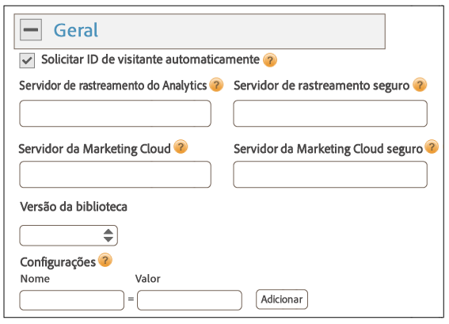
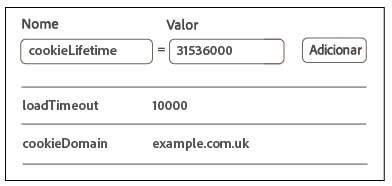
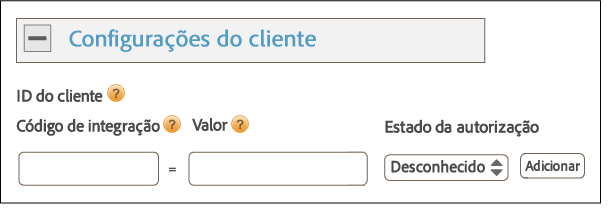

# Implementação com o Dynamic Tag Management{#implementation-with-dynamic-tag-management}

Implementações mais antigas usam o Gerenciamento dinâmico de tags (DTM) para configurar, implantar e integrar o Serviço de identidade da plataforma Experience Platform com suas outras soluções da Experience Cloud.

## Implementação com o Dynamic Tag Management {#topic-6f4ed5d96977406ca991e50f3fbd5b01}

Implementações mais antigas usam o Gerenciamento dinâmico de tags (DTM) para configurar, implantar e integrar o Serviço de identidade da plataforma Experience Platform com suas outras soluções da Experience Cloud.

>[!NOTE]
>
>Currently, [Adobe Experience Platform Launch](https://docs.adobelaunch.com/) is the preferred and recommended implementation tool because it helps simplify complex tag management tasks and automates code placement beyond the capabilities of DTM. Consulte [Implementação com o Launch](../implementation-guides/ecid-implement-with-launch.md).

## Dynamic Tag Management e o serviço de ID {#section-4a4c4fac5d0a4cbbaff8e1833f73657c}

[O Gerenciamento dinâmico de tags](https://marketing.adobe.com/resources/help/en_US/dtm/) permite configurar, implantar e gerenciar a instância do serviço de ID e as integrações relacionadas [!DNL Experience Cloud] à solução. O DTM ajuda a simplificar o processo de implementação, pois está integrado ao serviço de ID e às outras soluções da Experience Cloud. Adicione e configure a ferramenta da Experience Cloud ID e especifique informações, como:

* ID da organização da Experience Cloud (preenchida automaticamente se estiver vinculada à Experience Cloud)
* Servidor de rastreamento do Analytics (protegido e não protegido)
* Servidor da Experience Cloud (para servidores de rastreamento próprios)

O DTM está disponível sem custo para qualquer [!DNL Experience Cloud] cliente da.

**Introdução ao DTM**

O DTM é uma ferramenta simples e avançada. Se você já não estiver usando-o, é recomendado fazer a mudança. Consulte a [documentação](https://marketing.adobe.com/resources/help/en_US/dtm/c_overview.html) do DTM e os [vídeos de Início rápido do DTM](https://marketing.adobe.com/resources/help/en_US/dtm/jump-start-videos.html) para começar a usar o serviço. Para obter instruções sobre como configurar o serviço de ID com DTM, consulte as informações e os procedimentos nas seções abaixo.

## Diretrizes de implantação {#concept-54a2ec49af8f4bfca9207b1d404e8e1a}

Analise esses requisitos e procedimentos antes de tentar implementar o Serviço de identidade da plataforma de experiência com o Gerenciamento dinâmico de tags (DTM).

<!--
mcvid-dtm-deployment.xml
-->

**Provisionamento da conta**

Antes de começar, verifique se a organização e as soluções foram provisionadas para a [!DNL Experience Cloud] e se você está familiarizado com o [!DNL Dyanamic Tag Management]. Esta documentação pode ajudar você a começar a usar o serviço:

* [Ativar suas soluções para os principais serviços](https://marketing.adobe.com/resources/help/en_US/mcloud/core_services.html): Implemente a Experience Cloud e torne-se um administrador. Esse processo moderniza suas soluções para os principais serviços, como atributos do cliente e público-alvo da Experience Cloud.
* [Introdução ao Dynamic Tag Management](https://marketing.adobe.com/resources/help/en_US/dtm/get_started.html)
* [Vídeos de início rápido](https://marketing.adobe.com/resources/help/en_US/dtm/jump-start-videos.html): Uma série de pequenos vídeos que demonstram como executar tarefas básicas do DTM.

**Inserção de código do serviço de ID e ordem de carregamento**

O serviço de ID funciona ao solicitar e receber uma ID exclusiva dos servidores de coleta de dados da [!DNL Adobe]. Para funcionar adequadamente, o código do serviço de ID deve ser:

* O primeiro bloco do [!DNL Adobe] código da que é executado na página.
* Inserido o mais alto possível na página, normalmente, no `<head>` bloco de código de.

Enquanto você tiver soluções e bibliotecas de código da [!DNL Adobe] no DTM, isso garante que o código do serviço de ID estará no local adequado e será acionado no momento certo.

**Validar a coleta de dados regionais**

Customers must provide a CNAME or use [!DNL *.sc.omtrdc] for [regional data collection](https://marketing.adobe.com/resources/help/en_US/whitepapers/rdc/) (RDC). Obtenhas as configurações específicas de RDC do consultor da [!DNL Adobe].

**Configurar conjuntos de relatórios do Analytics**

Os novos clientes do [!DNL Analytics] devem [criar um conjunto de relatórios](https://marketing.adobe.com/resources/help/en_US/reference/new_report_suite.html) para a coleta de dados.

## Implement the Experience Platform Identity Service with DTM {#task-a659cf19dea84ad48edabe0b72ef9f5c}

Siga estas etapas para implementar o serviço de ID com Dynamic Tag Management (DTM).

**Pré-requisitos**

* Ative as soluções na [!DNL Experience Cloud] e verifique se você tem permissões de administrador. See [Enable your solutions for core services](https://marketing.adobe.com/resources/help/en_US/mcloud/core_services.html).

* Crie uma propriedade da Web no DTM. Consulte a documentação do DTM [Criar uma propriedade da Web](https://marketing.adobe.com/resources/help/en_US/dtm/web_property.html) ou o [vídeo Início rápido do administrador](https://marketing.adobe.com/resources/help/en_US/dtm/admin-jump-start.html).

<!--
mcvid-dtm-implement.xml
-->

**Etapas de implementação** Para implementar o serviço de ID com DTM:

1. No [!DNL Dashboard] do DTM, clique na propriedade da Web com a qual você deseja trabalhar.
1. **Na guia[!UICONTROL Visão geral]** da propriedade da Web selecionada, clique em **[!UICONTROL Adicionar uma ferramenta]**.
1. In the **[!UICONTROL Tool Type]** list, click **[!UICONTROL Experience Platform Identity Service]**.

   >[!NOTE]
   >
   >Essa ação preenche a caixa da **[!UICONTROL ID da organização da Experience Cloud]** com a ID da organização. Se a conta do DTM não estiver vinculada à [!DNL Experience Cloud], é necessário fornecer essa ID. Para vincular a conta, consulte [Vincular contas na Experience Cloud](https://marketing.adobe.com/resources/help/en_US/mcloud/organizations.html). Consulte os [requisitos](../reference/requirements.md#section-a02f537129a64ffbb690d5738d360c26) para obter mais informações sobre como encontrar a ID da organização.

1. Digite o nome do servidor de rastreamento na caixa **[!UICONTROL Servidor de rastreamento]**. If you&#39;re not sure how to find your tracking server see the [FAQ](../faq-intro/faq.md) and [Correctly Populate the trackingServer and trackingServerSecure variables](https://helpx.adobe.com/analytics/kb/determining-data-center.html#).
1. Clique em **[!UICONTROL Criar ferramentas]** e **[!UICONTROL Salvar alterações]**.

   Depois de salvar, o serviço de ID é configurado como uma ferramenta no DTM. No entanto, ainda não está pronto para uso. A ferramenta do DTM ainda precisa passar no processo de publicação/aprovação do DTM e pode ser necessário configurar mais parâmetros. Para obter mais informações sobre o processo de aprovação do DTM, assista ao vídeo [Início rápido dos conceitos básicos do usuário](https://marketing.adobe.com/resources/help/en_US/dtm/user-basics-jump-start.html). Para obter mais informações sobre mais parâmetros para adicionar ao DTM, consulte [Configurações do serviço de identidade da plataforma de experiência para DTM](../implementation-guides/standard.md#concept-fb6cb6a0e6cc4f10b92371f8671f6b59).

>[!MORE_LIKE_THIS]
>
>* [Propriedades da Web](https://marketing.adobe.com/resources/help/en_US/dtm/web_property.html)


## Experience Platform Identity Service Settings for DTM {#concept-fb6cb6a0e6cc4f10b92371f8671f6b59}

Descreve os campos [!DNL Organization ID], [!DNL General] e [!DNL Customer Settings] e como são usados pelo [!DNL Experience Cloud] serviço de ID.

<!--
mcvid-dtm-settings.xml
-->

## Como descobrir essas configurações? {#section-c5b2d1c928944ae2b8565c1b182fe575}

Essas configurações estão disponíveis depois de adicionar e salvar o serviço de ID como uma ferramenta no Dynamic Tag Management (DTM). Também é possível acessar essas configuração ao clicar no ícone de engrenagem da seção [!DNL Installed Tools] da propriedade da Web do DTM.


## ID da organização {#section-949b5a0d8af940558b04ff675cf53f77}

Essa é a ID exigida e associada à empresa provisionada na [!DNL Experience Cloud]. Uma organização é uma entidade que permite ao administrador configurar usuários, grupos e controlar o logon único na [!DNL Experience Cloud]. Essa ID da organização é uma sequência de 24 caracteres alfanuméricos, seguida (e deve incluir) por @AdobeOrg. Os administradores da [!DNL Experience Cloud] podem encontrar essa ID em [Experience Cloud &gt; Ferramentas](https://marketing.adobe.com/resources/help/en_US/mcloud/admin_getting_started.html).


See also [Cookies and the Experience Platform Identity Service](../introduction/cookies.md).

## Configurações gerais {#section-071d358e40f84629a8901b893dd61392}

Essas configurações permitem que você especifique servidores de rastreamento, versões de código e adicione outras variáveis.



A tabela a seguir lista e define as configurações [!DNL General].

**Solicitar ID de visitante automaticamente**

When checked, dynamic tag management to automatically calls the `getMarketingCloudVisitorID()` method before loading any of the Adobe solutions that use the Experience Platform Identity Service.

Consulte [getMarketingCloudVisitorID](../library/get-set/getmcvid.md).

**Servidor de rastreamento do Analytics**

O nome do servidor de rastreamento usado para coleta de dados do Analytics. Esse é o domínio no qual a solicitação de imagem e o cookie é gravado (por exemplo, [!DNL http://site.omtrdc.net]).

Se você não souber os URLs do servidor de rastreamento, verifique os arquivos `s_code.js` ou `AppMeasurement.js`. O ideal é que o URL seja definido pela `s.trackingServer` variável.

Consulte [trackingServer](https://marketing.adobe.com/resources/help/en_US/sc/implement/trackingServer.html) e [preencha corretamente as variáveis trackingServer e trackingServerSecure](https://helpx.adobe.com/analytics/kb/determining-data-center.html#).

**Servidor de rastreamento seguro**

O nome do servidor de rastreamento seguro usado para coleta de dados do Analytics. Esse é o domínio no qual a solicitação de imagem e o cookie é gravado (por exemplo, [!DNL https://site.omtrdc.net]).

Se você não souber os URLs do servidor de rastreamento, verifique os arquivos `s_code.js` ou `AppMeasurement.js`. O ideal é que o URL seja definido pela `s.trackingServerSecure` variável.

Consulte [trackingServer](https://marketing.adobe.com/resources/help/en_US/sc/implement/trackingServer.html) e [preencha corretamente as variáveis trackingServer e trackingServerSecure](https://helpx.adobe.com/analytics/kb/determining-data-center.html#).

**Servidor da Experience Cloud**

Se a empresa usa a coleta de dados primários (CNAME) a fim de usar cookies primários em um contexto de terceiros, insira o servidor de rastreamento aqui (por exemplo, [!DNL http://metrics.company.com]).

**Servidor seguro da Experience Cloud**

Se a empresa usa a coleta de dados primários (CNAME) a fim de usar cookies primários em um contexto de terceiros, insira o servidor de rastreamento aqui (por exemplo, [!DNL https://metrics.company.com]).

**Versão da biblioteca**

Define a versão da biblioteca de código do serviço de ID (`VisitorAPI.js`) que você deseja usar. Não é possível editar essas opções de menu.

**Configurações**

Esses campos permitem que você adicione [variáveis de função](../library/function-vars/function-vars.md) como pares de valores chave. Clique em **[!UICONTROL Adicionar]** para adicionar uma ou mais variáveis à implementação do serviço de ID.



>[!IMPORTANT]
>
>Defina a `cookieDomain` variável aqui. Essa variável é necessária para domínios de alto nível e com muitas partes, em que qualquer uma das duas últimas partes do URL é &gt; do que dois caracteres. Consulte a documentação de Variáveis de configuração acima.

## Configurações do cliente {#section-238d1272c1504d148fe38fb0ae5d71c2}

Campos adicionais que permitem adicionar um código de integração ou status de estado autenticado.



**Código de integração**

Um código de integração é uma ID exclusiva fornecida pelo cliente. O código de integração deve conter o valor usado para [criar uma fonte de dados](https://marketing.adobe.com/resources/help/en_US/aam/create-datasource.html) no [!DNL Audience Manager].

**Valor**

O valor deve ser um elemento de dados com a id do usuário. Os elementos de dados são contêineres adequados para valores dinâmicos, como IDs de um sistema interno específico do cliente.

**Estado da autorização**

As opções que definem ou identificam os visitantes de acordo com o status de autenticação (por exemplo, conectado, desconectado). Consulte [IDs do cliente e Estados de autenticação](../reference/authenticated-state.md).

## Test and verify the Experience Platform Identity Service {#concept-644fdbef433b46ba9c0634ac95eaa680}

Essas instruções, ferramentas e procedimentos ajudam você a determinar se o serviço de ID está funcionando adequadamente. Os testes se aplicam ao serviço de ID em geral, bem como para combinações diferentes do serviço de ID e soluções da [!DNL Experience Cloud].

<!--
mcvid-test-verify.xml
-->

## Antes de começar {#section-b1e76ad552ed4eb793b6e521a55127d4}

Informações importantes a saber antes de iniciar o teste e a verificação do serviço de ID.

**Ambientes do navegador**

Ao testar em uma sessão normal do navegador, limpe o cache do navegador antes de cada teste.

Como alternativa, você pode testar o serviço de ID em uma sessão de navegador anônima ou incógnita. Em uma sessão anônima, não é necessário apagar os cookies do navegador ou o cache antes de cada teste.

**Ferramentas**

O [depurador da Adobe](https://marketing.adobe.com/resources/help/en_US/sc/implement/debugger.html) e o [proxy HTTP Charles](https://www.charlesproxy.com/) podem ajudar você a determinar se o serviço de ID foi configurado adequadamente para funcionar com o Analytics. As informações nesta seção têm por base os resultados retornados pelo depurador da Adobe e o Charles. Entretanto, você pode usar qualquer ferramenta ou depurador adequado para suas necessidades.

## Teste com o Adobe Debugger {#section-861365abc24b498e925b3837ea81d469}

A integração de serviço é configurada adequadamente ao visualizar uma [!DNL Experience Cloud ID] (MID) na resposta do depurador da [!DNL Adobe]. See [Cookies and the Experience Platform Identity Service](../introduction/cookies.md) for more information about the MID.

To verify the status of the ID service with the [!DNL Adobe] [debugger](https://marketing.adobe.com/resources/help/en_US/sc/implement/debugger.html):

1. Apague os cookies do navegador ou abra uma sessão de navegação anônima.
1. Carregue a página de teste com o código do serviço de ID.
1. Abra o depurador da [!DNL Adobe].
1. Verifique se nos resultados há uma MID.

## Compreender os resultados do Adobe Debugger {#section-bd2caa6643d54d41a476d747b41e7e25}

A MID é armazenada em um par de valores chave que usa a sintaxe: `MID= *`Experience Cloud ID`*`. O depurador exibe essas informações, como mostrado abaixo.

**Sucesso**

O serviço de ID terá sido implementado adequadamente se você observar uma resposta semelhante a:

```
mid=20265673158980419722735089753036633573
```

Se você for um cliente do [!DNL Analytics], é possível visualizar uma ID do [!DNL Analytics] (AID) além da MID. O seguinte ocorre:

* Com alguns dos primeiros visitantes ou os mais antigos.
* Se você tem um período de carência.

**Falha**

Entre em contato com o [atendimento ao cliente](https://helpx.adobe.com/marketing-cloud/contact-support.html) se o depurador:

* Não retornar uma MID.
* Retornar uma mensagem de erro indicando que a ID do parceiro não foi fornecida.

## Teste com o Charles HTTP proxy {#section-d9e91f24984146b2b527fe059d7c9355}

Para verificar o status do serviço de ID com Charles:

1. Apague os cookies do navegador ou abra uma sessão de navegação anônima.
1. Inicie o Charles.
1. Carregue a página de teste com o código do serviço de ID.
1. Verifique as chamadas de solicitação e resposta, além dos dados descritos abaixo.

## Como entender os resultados do Charles {#section-c10c3dc0bb9945cbaffcf6fec7082fab}

Consulte esta seção para obter informações sobre o que e onde procurar, ao usar o Charles para monitorar chamadas HTTP.

**Solicitações de serviço de ID com sucesso no Charles**

O código do serviço de ID está funcionando adequadamente quando a função `Visitor.getInstance` efetua uma chamada de JavaScript para `dpm.demdex.net`. Uma solicitação bem sucedida inclui a [ID da organização](../reference/requirements.md#section-a02f537129a64ffbb690d5738d360c26). A ID da empresa é passada como um par de valores chave que utiliza a sintaxe: `d_orgid= *`ID da organização`*`. Procure o `dpm.demdex.net` e as chamadas de JavaScript na guia [!DNL Structure]. Procure a ID da organização na guia [!DNL Request].


**Solicitações do serviço de ID com sucesso no Charles**

Sua conta recebe corretamente o serviço de ID quando a resposta dos [Servidores de coleta de dados](https://marketing.adobe.com/resources/help/en_US/aam/c_compcollect.html) (DCS) retornar uma MID. A MID é retornada em um par de valores chave que usa a sintaxe: `d_mid: *`Experience Cloud ID do visitante`*`. Procure a MID na guia [!DNL Response], como mostrado abaixo.


**Falha de resposta do serviço de ID no Charles**

A conta não foi provisionada adequadamente se a MID estiver faltando na resposta do DCS. Uma resposta sem sucesso retorna um código de erro e a mensagem na guia [!DNL Response], como mostrado abaixo. Entre em contato com o atendimento ao cliente se você visualizar essa mensagem de erro na resposta do DCS.


Para obter mais informações sobre os códigos de erro, consulte [Códigos, mensagens e exemplos de erro do DCS](https://marketing.adobe.com/resources/help/en_US/aam/dcs_error_codes.html).
