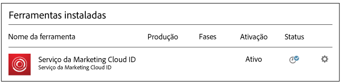
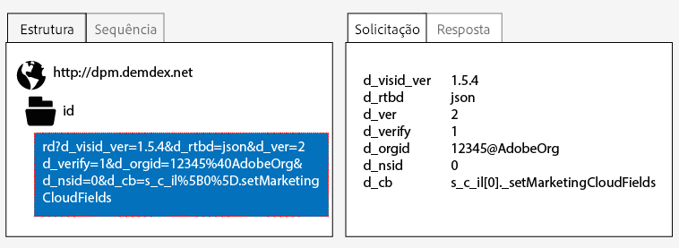
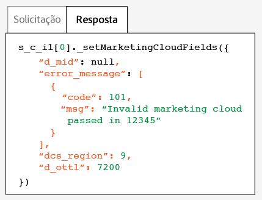

# Implementação com o Dynamic Tag Management {#implementation-with-dynamic-tag-management}

As implementações mais antigas usam o Dynamic Tag Management (DTM) para configurar, implantar e integrar o serviço de identidade da Experience Cloud às outras soluções da Experience Cloud.

## Implementação com o Dynamic Tag Management {#topic-6f4ed5d96977406ca991e50f3fbd5b01}

As implementações mais antigas usam o Dynamic Tag Management (DTM) para configurar, implantar e integrar o serviço de identidade da Experience Cloud às outras soluções da Experience Cloud.

>[!NOTE]
>
>Atualmente, o [Adobe Experience Platform Launch](https://docs.adobe.com/content/help/pt-BR/launch/using/overview.html) é a ferramenta de implementação preferida e recomendada porque ajuda a simplificar tarefas complexas de gerenciamento de tags e automatiza a inserção de código, além dos recursos do DTM. Consulte [Implementação com o Launch](../implementation-guides/ecid-implement-with-launch.md).

## Dynamic Tag Management e o serviço de ID {#section-4a4c4fac5d0a4cbbaff8e1833f73657c}

O [Dynamic Tag Management](https://docs.adobe.com/content/help/pt-BR/dtm/using/dtm-home.html) permite configurar, implantar e gerenciar a instância do serviço de ID e as integrações de soluções [!DNL Experience Cloud] relacionadas. O DTM ajuda a simplificar o processo de implementação, pois está profundamente integrado ao serviço de ID e a outras soluções da Experience Cloud. Basta adicionar e configurar a ferramenta da Experience Cloud ID e especificar informações, como:

* ID de organização da Experience Cloud (preenchida automaticamente se vinculada à Experience Cloud)
* Servidor de rastreamento do Analytics (protegido e não protegido)
* Servidor da Experience Cloud (para servidores de rastreamento próprios)

O DTM está disponível sem custo para qualquer cliente da[!DNL Experience Cloud].

**Introdução ao DTM**

O DTM é uma ferramenta simples, mas eficiente. Se você ainda não estiver usando, nós incentivamos você a usá-la. Consulte a [Documentação do DTM](https://docs.adobe.com/content/help/pt-BR/dtm/using/c-overview.html) para começar a usar esse serviço. Para obter instruções sobre como configurar o serviço de ID com DTM, consulte as informações e os procedimentos nas seções abaixo.

## Diretrizes de implantação {#concept-54a2ec49af8f4bfca9207b1d404e8e1a}

Releia estes requisitos e procedimentos antes de tentar implementar o serviço de identidade da Experience Cloud com o Dynamic Tag Management (DTM).

<!--
mcvid-dtm-deployment.xml
-->

**Provisionamento da conta**

Antes de começar, verifique se a organização e as soluções foram provisionadas para a [!DNL Experience Cloud] e se você está familiarizado com o [!DNL Dyanamic Tag Management]. Esta documentação pode ajudar você a começar a usar o serviço:

* [Ativar as soluções para os serviços principais](https://docs.adobe.com/content/help/pt-BR/core-services/interface/about-core-services/core-services.html): implemente a Experience Cloud e torne-se um administrador. Esse processo moderniza suas soluções para os principais serviços, como atributos do cliente e público-alvo da Experience Cloud.
* [Introdução ao Dynamic Tag Management](https://docs.adobe.com/content/help/pt-BR/dtm/using/getting-started/get-started.html).

**Inserção de código do serviço de ID e ordem de carregamento**

O serviço de ID funciona ao solicitar e receber uma ID exclusiva dos servidores de coleta de dados da [!DNL Adobe]. Para funcionar adequadamente, o código do serviço de ID deve ser:

* O primeiro bloco do [!DNL Adobe] código da que é executado na página.
* Inserido o mais alto possível na página, normalmente, no `<head>` bloco de código de.

Enquanto você tiver soluções e bibliotecas de código da [!DNL Adobe] no DTM, isso garante que o código do serviço de ID estará no local adequado e será acionado no momento certo.

**Validar a coleta de dados regionais**

Os clientes devem fornecer um CNAME ou usar `*.sc.omtrdc` para a [coleta de dados regional](https://docs.adobe.com/content/help/pt-BR/analytics/technotes/rdc/regional-data-collection.html) (RDC). Obtenhas as configurações específicas de RDC do consultor da [!DNL Adobe].

**Configurar conjuntos de relatórios do Analytics**

Os novos clientes do [!DNL Analytics] devem [criar um conjunto de relatórios](https://docs.adobe.com/content/help/pt-BR/analytics/admin/manage-report-suites/new-report-suite/new-report-suite.html) para a coleta de dados.

## Implementar o serviço de identidade da Experience Cloud com DTM {#task-a659cf19dea84ad48edabe0b72ef9f5c}

Siga estas etapas para implementar o serviço de ID com o Dynamic Tag Management (DTM).

**Pré-requisitos**

* Ative as soluções na [!DNL Experience Cloud] e verifique se você tem permissões de administrador. Consulte [Ativar as soluções dos serviços principais](https://docs.adobe.com/content/help/pt-BR/core-services/interface/about-core-services/core-services.html).

* Crie uma propriedade da Web no DTM. Consulte a documentação [Criar uma propriedade da Web no DTM](https://docs.adobe.com/content/help/pt-BR/dtm/using/admin/web-property.html).

<!--
mcvid-dtm-implement.xml
-->

**Etapas de implementação** Para implementar o serviço de ID com DTM:

1. No [!UICONTROL Painel] do DTM, clique na propriedade da Web com a qual você deseja trabalhar.
1. Na guia **[!UICONTROL Visão geral]** da propriedade da Web selecionada, clique em **[!UICONTROL Adicionar uma ferramenta]**.
1. Na lista **[!UICONTROL Tipo de ferramenta]**, clique em **[!UICONTROL serviço de identidade da Experience Cloud]**.

   >[!NOTE]
   >
   >Essa ação preenche a caixa da **[!UICONTROL ID da organização da Experience Cloud]** com a ID da organização. Se a conta do DTM não estiver vinculada à [!DNL Experience Cloud], é necessário fornecer essa ID. Para vincular a conta, consulte [Vincular contas na Experience Cloud](https://docs.adobe.com/content/help/pt-BR/core-services/interface/manage-users-and-products/organizations.html). Consulte os [requisitos](../reference/requirements.md#section-a02f537129a64ffbb690d5738d360c26) para obter mais informações sobre como encontrar a ID da organização.

1. Digite o nome do servidor de rastreamento na caixa **[!UICONTROL Servidor de rastreamento]**. Caso não tenha certeza de como encontrar o servidor de rastreamento, consulte [Perguntas frequentes](../faq-intro/faq.md) e [Preencher corretamente as variáveis trackingServer e trackingServerSecure](https://helpx.adobe.com/br/analytics/kb/determining-data-center.html#).
1. Clique em **[!UICONTROL Criar ferramentas]** e **[!UICONTROL Salvar alterações]**.

   Após salvar, o serviço de ID é configurado como uma ferramenta no DTM. Mas ainda não está pronto para uso. A ferramenta de DTM ainda precisa passar pelo processo de publicação/aprovação do DTM e talvez você queira configurar parâmetros adicionais. Para obter informações sobre os parâmetros adicionais que podem ser incluídos no DTM, consulte [Configurações do serviço de identidade da Experience Cloud para DTM](../implementation-guides/standard.md#concept-fb6cb6a0e6cc4f10b92371f8671f6b59).

## Configurações do serviço de identidade da Experience Cloud para DTM {#concept-fb6cb6a0e6cc4f10b92371f8671f6b59}

Descreve os campos [!UICONTROL ID da organização], [!UICONTROL Geral] e [!UICONTROL Configurações do cliente], e como são usados pelo serviço da [!DNL Experience Cloud] ID.

<!--
mcvid-dtm-settings.xml
-->

## Como descobrir essas configurações? {#section-c5b2d1c928944ae2b8565c1b182fe575}

Essas configurações estão disponíveis depois de adicionar e salvar o serviço de ID como uma ferramenta no Dynamic Tag Management (DTM). Também é possível acessar essas configuração ao clicar no ícone de engrenagem da seção [!UICONTROL Ferramentas instaladas] da propriedade da Web do DTM.



## ID da organização {#section-949b5a0d8af940558b04ff675cf53f77}

Essa é a ID exigida e associada à empresa provisionada na [!DNL Experience Cloud]. Uma organização é uma entidade que permite ao administrador configurar usuários, grupos e controlar o logon único na [!DNL Experience Cloud]. Essa ID da organização é uma sequência de 24 caracteres alfanuméricos, seguida (e deve incluir) por @AdobeOrg. Os administradores da [!DNL Experience Cloud] podem encontrar essa ID em [Experience Cloud > Ferramentas](https://docs.adobe.com/content/help/pt-BR/core-services/interface/manage-users-and-products/admin-getting-started.html).


Consulte [Cookies e o serviço de identidade da Experience Cloud](../introduction/cookies.md).

## Configurações gerais {#section-071d358e40f84629a8901b893dd61392}

Essas configurações permitem que você especifique servidores de rastreamento, versões de código e adicione outras variáveis.


A tabela a seguir lista e define as configurações [!UICONTROL Gerais].

**Solicitar ID de visitante automaticamente**

Quando marcado, o Dynamic Tag Management chama automaticamente o método `getMarketingCloudVisitorID()` antes de carregar qualquer solução da Adobe que usa o serviço de identidade da Experience Cloud.

Consulte [getMarketingCloudVisitorID](../library/get-set/getmcvid.md).

**Servidor de rastreamento do Analytics**

O nome do servidor de rastreamento usado para a coleta de dados do Analytics. Esse é o domínio no qual a solicitação de imagem e o cookie é gravado (por exemplo, `http://site.omtrdc.net`).

Se você não souber os URLs do servidor de rastreamento, verifique os arquivos `s_code.js` ou `AppMeasurement.js`. O ideal é que o URL seja definido pela `s.trackingServer` variável.

Consulte [trackingServer](https://docs.adobe.com/content/help/pt-BR/analytics/implementation/vars/page-vars/page-variables.html) e [preencha corretamente as variáveis trackingServer e trackingServerSecure](https://helpx.adobe.com/br/analytics/kb/determining-data-center.html#).

**Servidor de rastreamento seguro**

O nome do servidor de rastreamento seguro usado para a coleta de dados do Analytics. Esse é o domínio no qual a solicitação de imagem e o cookie é gravado (por exemplo, `https://site.omtrdc.net`).

Se você não souber os URLs do servidor de rastreamento, verifique os arquivos `s_code.js` ou `AppMeasurement.js`. O ideal é que o URL seja definido pela `s.trackingServerSecure` variável.

Consulte [trackingServer](https://docs.adobe.com/content/help/pt-BR/analytics/implementation/vars/page-vars/page-variables.html) e [preencha corretamente as variáveis trackingServer e trackingServerSecure](https://helpx.adobe.com/br/analytics/kb/determining-data-center.html#).

**Servidor da Experience Cloud**

Se a empresa usa a coleta de dados primários (CNAME) a fim de usar cookies primários em um contexto de terceiros, insira o servidor de rastreamento aqui (por exemplo, `http://metrics.company.com`).

**Servidor seguro da Experience Cloud**

Se a empresa usa a coleta de dados primários (CNAME) a fim de usar cookies primários em um contexto de terceiros, insira o servidor de rastreamento aqui (por exemplo, `https://metrics.company.com`).

**Versão da biblioteca**

Define a versão da biblioteca de código do serviço de ID (`VisitorAPI.js`) que você deseja usar. Não é possível editar essas opções de menu.

**Configurações**

Esses campos permitem que você adicione [variáveis de função](../library/function-vars/function-vars.md) como pares de valores chave. Clique em **[!UICONTROL Adicionar]** para adicionar uma ou mais variáveis à implementação do serviço de ID.


>[!IMPORTANT]
>
>Defina a `cookieDomain` variável aqui. É necessário para domínios de alto nível e com várias partes, em que qualquer uma das duas últimas partes do URL tem mais de dois caracteres. Consulte a documentação Variáveis de configuração vinculada acima.

## Configurações do cliente {#section-238d1272c1504d148fe38fb0ae5d71c2}

Campos adicionais que permitem adicionar um código de integração ou status de estado autenticado.


**Código de integração**

Um código de integração é uma ID exclusiva fornecida pelo cliente. O código de integração deve conter o valor usado para [criar uma fonte de dados](hhttps://docs.adobe.com/content/help/en/audience-manager/user-guide/features/data-sources/manage-datasources.html#create-data-source) no [!DNL Audience Manager].

**Valor**

O valor deve ser um elemento de dados contendo a ID do usuário. Os elementos de dados são contêineres adequados para valores dinâmicos, como IDs de um sistema interno específico do cliente.

**Estado de autenticação**

Opções que definem ou identificam visitantes de acordo com seu status de autenticação (por exemplo, conectado, desconectado). Consulte [IDs do cliente e Estados de autenticação](../reference/authenticated-state.md).

## Testar e verificar o serviço de identidade da Experience Cloud {#concept-644fdbef433b46ba9c0634ac95eaa680}

Essas instruções, ferramentas e procedimentos ajudam você a determinar se o serviço de ID está funcionando adequadamente. Os testes se aplicam ao serviço de ID em geral, bem como para combinações diferentes do serviço de ID e soluções da [!DNL Experience Cloud].

<!--
mcvid-test-verify.xml
-->

## Antes de começar {#section-b1e76ad552ed4eb793b6e521a55127d4}

Informações importantes a saber antes de iniciar o teste e a verificação do serviço de ID.

**Ambientes do navegador**

Ao testar em uma sessão normal do navegador, limpe o cache do navegador antes de cada teste.

Como alternativa, você pode testar o serviço de ID em uma sessão anônima ou incógnita do navegador. Em uma sessão anônima, não é necessário limpar os cookies ou o cache do navegador antes de cada teste.

**Ferramentas**

O [depurador da Adobe](https://docs.adobe.com/content/help/pt-BR/analytics/implementation/validate/debugger.html) e o [proxy HTTP Charles](https://www.charlesproxy.com/) podem ajudar você a determinar se o serviço de ID foi configurado adequadamente para funcionar com o Analytics. As informações nesta seção baseiam-se nos resultados retornados pelo Adobe Debugger e Charles. Entretanto, você pode usar qualquer ferramenta ou depurador adequado para suas necessidades.

## Teste com o Adobe Debugger {#section-861365abc24b498e925b3837ea81d469}

A integração de serviço é configurada adequadamente ao visualizar uma [!DNL Experience Cloud ID] (MID) na resposta do depurador da [!DNL Adobe]. Consulte [Cookies e o serviço de identidade da Experience Cloud](../introduction/cookies.md) para obter mais informações sobre a MID.

Para verificar o status do serviço de ID com o [depurador](https://docs.adobe.com/content/help/pt-BR/analytics/implementation/validate/debugger.html) da [!DNL Adobe]:

1. Limpe os cookies do navegador ou abra uma sessão de navegação anônima.
1. Carregue a página de teste que contém o código do serviço de ID.
1. Abra o depurador da [!DNL Adobe].
1. Verifique se nos resultados há uma MID.

## Compreender os resultados do Adobe Debugger {#section-bd2caa6643d54d41a476d747b41e7e25}

A MID é armazenada em um par de valores chave que usa a sintaxe: `MID= *`Experience Cloud ID`*`. O depurador exibe essas informações, como mostrado abaixo.

**Sucesso**

O serviço de ID foi implementado corretamente se você visualizar uma resposta semelhante a esta:

```
mid=20265673158980419722735089753036633573
```

Se você for um cliente do [!DNL Analytics], é possível visualizar uma ID do [!DNL Analytics] (AID) além da MID. Isso acontece:

* Com alguns de seus visitantes do site precoces ou de longa data.
* Se você tiver um período de carência habilitado.

**Falha**

Entre em contato com o [atendimento ao cliente](https://helpx.adobe.com/br/marketing-cloud/contact-support.html) se o depurador:

* Não retornar uma MID.
* Retornar uma mensagem de erro indicando que a ID do parceiro não foi fornecida.

## Teste com o Charles HTTP proxy {#section-d9e91f24984146b2b527fe059d7c9355}

Para verificar o status do serviço de ID com o Charles:

1. Limpe os cookies do navegador ou abra uma sessão de navegação anônima.
1. Iniciar o Charles.
1. Carregue a página de teste que contém o código do serviço de ID.
1. Verifique as chamadas de solicitação e resposta e os dados descritos abaixo.

## Como entender os resultados do Charles {#section-c10c3dc0bb9945cbaffcf6fec7082fab}

Consulte esta seção para obter informações sobre o que e onde procurar, ao usar o Charles para monitorar chamadas HTTP.

### Solicitações de serviço de ID com sucesso no Charles

O código do serviço de ID está funcionando adequadamente quando a função `Visitor.getInstance` efetua uma chamada de JavaScript para `dpm.demdex.net`. Uma solicitação bem sucedida inclui a [ID da organização](../reference/requirements.md#section-a02f537129a64ffbb690d5738d360c26). A ID da empresa é passada como um par de valores chave que utiliza a sintaxe: `d_orgid= *`ID da organização`*`. Procure `dpm.demdex.net` e as chamadas de JavaScript na guia [!UICONTROL Estrutura]. Procure pela ID da organização na guia [!UICONTROL Solicitação].



### Solicitações do serviço de ID com sucesso no Charles

Sua conta recebe corretamente o serviço de ID quando a resposta dos [Servidores de coleta de dados](https://docs.adobe.com/content/help/pt-BR/audience-manager/user-guide/reference/system-components/components-data-collection.html) (DCS) retornar uma MID. A MID é retornada como um par de valores chave que usa a sintaxe: `d_mid: visitor Experience Cloud ID`. Procure a MID na guia [!UICONTROL Resposta], como mostrado abaixo.


### Falha de resposta do serviço de ID no Charles

A conta não foi provisionada adequadamente se a MID estiver faltando na resposta do DCS. Uma resposta sem sucesso retorna um código de erro e a mensagem na guia [!UICONTROL Response], como mostrado abaixo. Entre em contato com o atendimento ao cliente se você visualizar essa mensagem de erro na resposta do DCS.



Para obter mais informações sobre os códigos de erro, consulte [Códigos de erro, mensagens e exemplos de DCS](https://docs.adobe.com/content/help/pt-BR/audience-manager/user-guide/api-and-sdk-code/dcs/dcs-api-reference/dcs-error-codes.html).

>[!MORELIKETHIS]
>
>* [Propriedades da Web](https://docs.adobe.com/content/help/pt-BR/dtm/using/admin/web-property.html)

