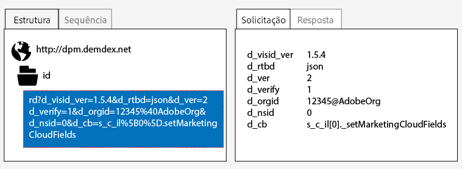
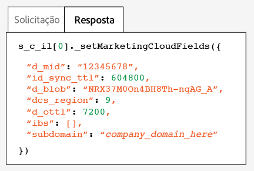
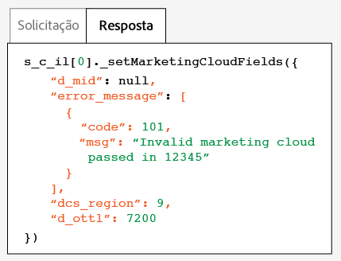

# Testar e verificar o serviço de identidade da Experience Cloud{#test-and-verify-the-experience-cloud-id-service}

Essas instruções, ferramentas e procedimentos ajudam você a determinar se o serviço de ID está funcionando adequadamente. Esses testes se aplicam ao serviço de ID em geral e a combinações diferentes de serviço de ID e solução da Experience Cloud.

## Antes de começar {#section-b1e76ad552ed4eb793b6e521a55127d4}

Informações importantes a saber antes de iniciar o teste e a verificação do serviço de ID.

**Ambientes do navegador**

Ao testar em uma sessão normal do navegador, limpe o cache do navegador antes de cada teste.

Como alternativa, você pode testar o serviço de ID em uma sessão anônima ou incógnita do navegador. Em uma sessão anônima, não é necessário limpar os cookies ou o cache do navegador antes de cada teste.

**Ferramentas**

O [depurador da Adobe](https://docs.adobe.com/content/help/en/analytics/implementation/validate/debugger.html) e o [proxy HTTP Charles](https://www.charlesproxy.com/) podem ajudar você a determinar se o serviço de ID foi configurado adequadamente para funcionar com o Analytics. As informações nesta seção baseiam-se nos resultados retornados pelo depurador da Adobe e Charles. Entretanto, você pode usar qualquer ferramenta ou depurador adequado para suas necessidades.

## Teste com o Adobe Debugger {#section-861365abc24b498e925b3837ea81d469}

A integração de serviço é configurada adequadamente ao visualizar uma [!DNL Experience Cloud ID] (MID) na resposta do depurador da [!DNL Adobe]. Consulte [Cookies e o serviço de identidade da Experience Cloud](../introduction/cookies.md) para obter mais informações sobre a MID.

Para verificar o status do serviço de ID com o [depurador](https://docs.adobe.com/content/help/en/analytics/implementation/validate/debugger.html) da [!DNL Adobe]:

1. Limpe os cookies do navegador ou abra uma sessão de navegação anônima.
1. Carregue a página de teste que contém o código do serviço de ID.
1. Abra o depurador da [!DNL Adobe].
1. Verifique se nos resultados há uma MID.

## Compreender os resultados do Adobe Debugger {#section-bd2caa6643d54d41a476d747b41e7e25}

A MID é armazenada em um par de valores chave que usa a sintaxe: `MID= *`Experience Cloud ID`*`. O depurador exibe essas informações, como mostrado abaixo.

**Sucesso**

O serviço de ID foi implementado corretamente se você visualizar uma resposta semelhante a esta:

```
mid=20265673158980419722735089753036633573
```

Se você for um cliente do [!DNL Analytics], é possível visualizar uma ID do [!DNL Analytics] (AID) além da MID. Isso acontece:

* Com alguns de seus visitantes de site precoces ou de longa data.
* Se você tiver um período de carência ativado.

**Falha**

Entre em contato com o Atendimento [ao](https://helpx.adobe.com/br/marketing-cloud/contact-support.html) cliente se o depurador:

* Não retorna uma MID.
* Retorna uma mensagem de erro indicando que a ID do parceiro não foi fornecida.

## Teste com o Charles HTTP proxy {#section-d9e91f24984146b2b527fe059d7c9355}

Para verificar o status do serviço de ID com Charles:

1. Limpe os cookies do navegador ou abra uma sessão de navegação anônima.
1. Start Charles.
1. Carregue a página de teste que contém o código do serviço de ID.
1. Verifique as chamadas de solicitação e resposta e os dados descritos abaixo.

## Como entender os resultados do Charles {#section-c10c3dc0bb9945cbaffcf6fec7082fab}

Consulte esta seção para obter informações sobre o que e onde procurar, ao usar o Charles para monitorar chamadas HTTP.

**Solicitações de serviço de ID com sucesso no Charles**

O código do serviço de ID está funcionando adequadamente quando a função `Visitor.getInstance` efetua uma chamada de JavaScript para `dpm.demdex.net`. Uma solicitação bem sucedida inclui a [ID da organização](../reference/requirements.md#section-a02f537129a64ffbb690d5738d360c26). A ID da empresa é passada como um par de valores chave que utiliza a sintaxe: `d_orgid= *`ID da organização`*`. Procure `dpm.demdex.net` e as chamadas de JavaScript na guia [!UICONTROL Estrutura]. Procure pela ID da organização na guia [!UICONTROL Solicitação].



**Solicitações do serviço de ID com sucesso no Charles**

Sua conta recebe corretamente o serviço de ID quando a resposta dos [Servidores de coleta de dados](https://docs.adobe.com/content/help/en/audience-manager/user-guide/reference/system-components/components-data-collection.html) (DCS) retornar uma MID. A MID é retornada em um par de valores chave que usa a sintaxe: `d_mid: *`Experience Cloud ID do visitante`*`. Procure a MID na guia [!UICONTROL Resposta], como mostrado abaixo.



**Falha de resposta do serviço de ID no Charles**

A conta não foi provisionada adequadamente se a MID estiver faltando na resposta do DCS. An unsuccessful response returns an error code and message in the [!UICONTROL Response] tab as shown below. Entre em contato com o atendimento ao cliente se você visualizar essa mensagem de erro na resposta do DCS.



For more information about error codes, see [DCS Error Codes, Messages, and Examples](https://docs.adobe.com/content/help/en/audience-manager/user-guide/api-and-sdk-code/dcs/dcs-api-reference/dcs-error-codes.html).
