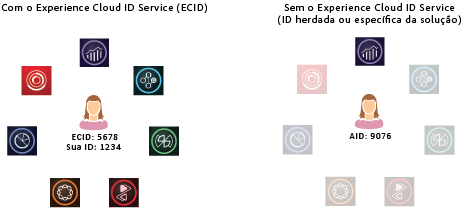

# Sobre o serviço de ID{#aboutidservice}

A função do serviço de identidade da Experience Cloud na Adobe Experience Cloud.

<!--
mcvid-functionality.xml
-->

## O serviço de identidade da Experience Cloud: um elemento base dos principais serviços {#section-2de0eb1d65664e92a4d8bbb167b84bde}

O serviço de identidade da Experience Cloud permite a estrutura de identificação comum para os serviços, as soluções e os atributos e públicos-alvo do cliente da Experience Cloud. Funciona ao atribuir uma ID exclusiva e persistente para um visitante do site. Quando sua organização implementa o serviço de ID, essa ID permite identificar o mesmo visitante do site e seus dados em diferentes soluções da Experience Cloud.

Além disso, o serviço de ID pode substituir diferentes IDs específicas da solução (por exemplo, Analytics AID). E, através da funcionalidade de [IDs de cliente e Estados de autenticação](../reference/authenticated-state.md), o serviço de ID permite que você passe suas próprias IDs de cliente para a [!DNL Experience Cloud]. No entanto, lembre-se de que o serviço de ID funciona apenas com as soluções nas quais você já está inscrito. Ele não fornecerá acesso a outros produtos se você não estiver inscrito neles.

O serviço de ID é um componente integral de diversos recursos, aprimoramentos e serviços atuais e [!DNL Experience Cloud] futuros da. No momento, o serviço de ID oferece suporte ao [Analytics](http://www.adobe.com/br/marketing-cloud/web-analytics.html), ao [Audience Manager](http://www.adobe.com/br/marketing-cloud/data-management-platform.html) e ao [Target](http://www.adobe.com/br/marketing-cloud/testing-targeting.html). É obrigatório se você deseja participar do [!DNL Adobe Experience Cloud] Device Co-op. Se você ainda não implementou o serviço de ID, agora é o momento de começar a pensar em uma estratégia de migração.

## Resumo dos recursos {#section-96555473455c4bf8924c2d56ff4f3255}

Resumindo, o serviço de ID:

* Cria uma chave comum ou ID que pode ser usada para vincular perfis e identidades.
* Identifica com exclusividade um dispositivo em várias soluções.
* Define um cookie próprio no domínio do cliente para garantir o rastreamento no mesmo domínio. Consulte [Experience Cloud](../introduction/cookies.md).
* Recebe aliases e mapeamentos de ID de [!DNL Experience Cloud] clientes e parceiros.
* Gerencia a sincronização de ID na [!DNL Experience Cloud].
* Oferece suporte à sincronização de ID com terceiros diferentes no ecossistema de tecnologia de anúncios.
