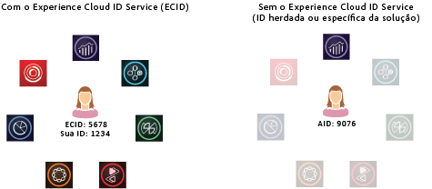

# Sobre o serviço de ID de visitante{#aboutidservice}

A função do Serviço de ID de visitante no Adobe CX Enterprise.

<!--
mcvid-functionality.xml
-->

## O serviço de ID de visitante: um elemento base dos principais serviços {#section-2de0eb1d65664e92a4d8bbb167b84bde}

O Serviço de ID do visitante habilita a estrutura de identificação comum para os principais serviços, soluções, atributos do cliente e públicos-alvo da CX Enterprise. Funciona ao atribuir uma ID exclusiva e persistente para um visitante do site. Quando sua organização implementa o Serviço de ID de visitante, essa ID permite identificar o mesmo visitante do site e seus dados em diferentes soluções da CX Enterprise.

Além disso, o Serviço de ID do visitante pode substituir diferentes IDs específicas da solução (por exemplo, Analytics AID). E, através da funcionalidade [IDs de cliente e Estados de autenticação](../reference/authenticated-state.md), o Serviço de ID de visitante permite que você passe suas próprias IDs de cliente para o CX Enterprise. No entanto, lembre-se de que o Serviço de ID de visitante funciona somente com as soluções nas quais você já está inscrito. Ele não fornecerá acesso a outros produtos se você não estiver inscrito neles.

O Serviço de ID de visitante é um componente integral de vários recursos, aprimoramentos e serviços atuais e futuros do CX Enterprise. Atualmente, o Serviço de ID de Visitante oferece suporte ao [Analytics](http://www.adobe.com/br/marketing-cloud/web-analytics.html), [Audience Manager](http://www.adobe.com/br/marketing-cloud/data-management-platform.html) e [Target](http://www.adobe.com/br/marketing-cloud/testing-targeting.html). É obrigatório se você deseja participar do Adobe Device Co-op. Se você não implementou o Serviço de ID de visitante, agora é o momento de começar a considerar uma estratégia de migração.

## Resumo dos recursos {#section-96555473455c4bf8924c2d56ff4f3255}

Resumindo, o Serviço de ID de visitante:

* Cria uma chave comum ou ID que pode ser usada para vincular perfis e identidades.
* Identifica com exclusividade um dispositivo em várias soluções.
* Define um cookie primário no domínio do cliente para garantir o rastreamento no mesmo domínio. Consulte [Cookies e o Serviço de ID de Visitante](../introduction/cookies.md).
* Recebe aliases e mapeamentos de ID de clientes e parceiros da CX Enterprise.
* Gerencia a sincronização de ID no CX Enterprise.
* Oferece suporte à sincronização de ID com terceiros diferentes no ecossistema de tecnologia de anúncios.

