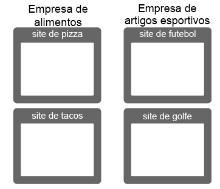
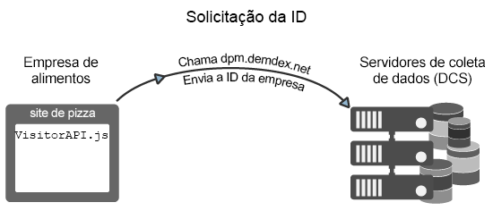
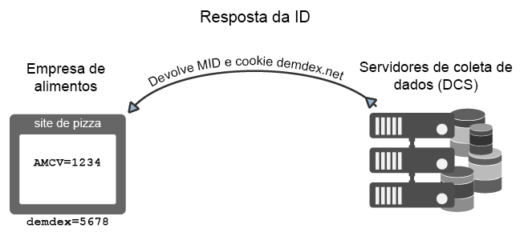
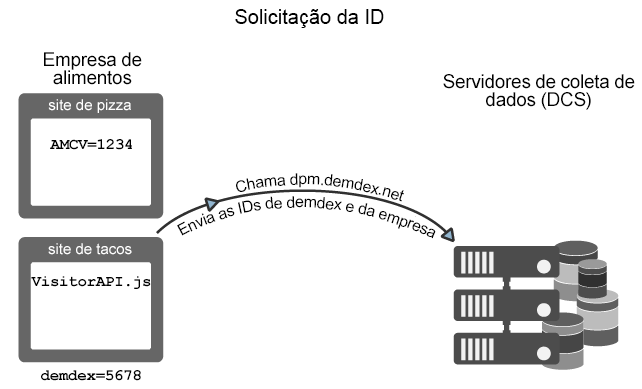
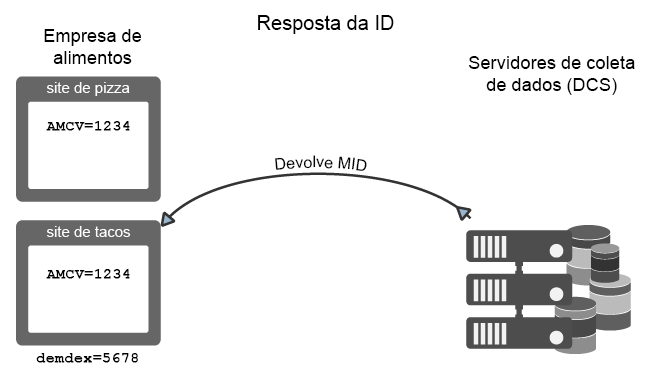
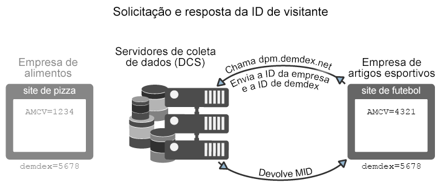

# How the Experience Cloud ID Service requests and sets IDs{#how-the-experience-cloud-id-service-requests-and-sets-ids}

Visão geral do processo de resposta e da solicitação de ID. Esses exemplos cobrem a atribuição de ID em sites individuais, em sites diferentes e para sites gerenciados por clientes diversos da Experience Cloud com suas próprias IDs da organização.

>[!NOTE]
>
>If you&#39;re not familiar with how the Experience Cloud ID Service creates the visitor ID, take a moment to review [Experience Cloud](../introduction/cookies.md).

**Dica:** consulte também o [vídeo do serviço de ID sobre rastreamento entre domínios](https://helpx.adobe.com/marketing-cloud-core/kb/MCID/CrossDomain.html).

## Solicitar uma Experience Cloud ID {#section-0b5e261fbd0547d9b9a1680e5ce536cc}

Os exemplos a seguir demonstram como o serviço de ID solicita e recebe a ID de visitante da Experience Cloud. Estes exemplos usam duas empresas fictícias, a Food Company e a Sports Company, para demonstrar os fluxos de dados das solicitações e respostas da ID. A duas empresas têm uma ID da organização da Experience Cloud exclusiva e implementaram o código do serviço de ID em seus sites. Esses casos de uso representam os fluxos de dados de uma implementação genérica do serviço de ID sem o Analytics, IDs herdadas ou navegadores que bloqueiem cookies de terceiros.

**Primeira solicitação**

Nesse exemplo, um novo visitante acessa o site de pizza gerenciado pela Food Company. A Food Company tem o código do serviço de ID do site de pizza. Quando o site de pizza é carregado, o código do serviço de ID verifica o cookie AMCV no domínio do site de pizza.

* Se o cookie AMCV estiver definido, o visitante do site tem uma Experience Cloud ID. Nesse caso, o cookie rastreia o visitante e compartilha dados com outras soluções da Experience Cloud.
* Se o cookie AMCV não estiver definido, o código do serviço de ID chama um [servidor de coleta de dados](https://marketing.adobe.com/resources/help/en_US/aam/?f=c_compcollect.html) (DCS) regional em `dpm.demdex.net/id` (consulte também, [Entender chamadas para o domínio Demdex](https://marketing.adobe.com/resources/help/en_US/aam/demdex-calls.html)). A chamada inclui a ID da organização da Food Company. A ID da organização está definida na função `Visitor.getInstance` do código do serviço de ID.

**Primeira resposta**

Na resposta, o DCS retorna a [!DNL Experience Cloud] ID (MID) e o cookie demdex. O código do serviço de ID grava o valor da MID no cookie AMCV. Por exemplo, digamos que o DCS retorne um valor de 1234. Ele estaria armazenado no cookie AMCV como `mid|1234` e definido no domínio principal do site de pizza. O cookie demdex também contém uma ID exclusiva (vamos chamá-la de 5678). Esse cookie é definido no domínio demdex.net de terceiros, que é diferente do domínio do site de pizza.

Como será visto no próximo exemplo, a ID demdex e a ID da organização permitem que o serviço de ID crie e retorne a MID correta quando o visitante for para outro site pertencente à Food Company.

## Cross-site request and response {#section-15ea880453af467abd2874b8b4ed6ee9}

Neste exemplo, o visitante da Food Company navega do site de pizza para o site de tacos. A Food Company tem o código do serviço de ID do site de tacos. O visitante nunca foi ao site de tacos.

Considerando essas condições, não há um cookie AMCV no site de tacos. E o serviço de ID não pode usar o cookie AMCV definido no site de pizza porque ele é específico do domínio do site de pizza. Como resultado, o serviço de ID deve chamar o DCS para verificar e solicitar uma ID de visitante. Nesse caso, a chamada do DCS inclui a ID da organização da Food Company *e* a ID demdex. E lembre-se que a ID demdex é selecionada do site de pizza e armazenada como um cookie de terceiros no domínio demdex.net.

Após o DCS receber a ID da organização e a ID demdex, ele cria e retorna a MID correta para o site visitante. Como a é derivada matematicamente da ID da organização e da ID demdex, o cookie AMCV contém o valor da MID `mid = 1234`mid = .

## ID requests from other sites {#section-ba9a929e50d64b0aba080630fd83b6f1}

Neste exemplo, o visitante deixa os sites da Food Company e navega para o site de futebol pertencente à Sports Company. Quando o visitante vai ao site de futebol, o processo de solicitação e verificação de ID funciona da mesma forma descrita nos exemplos anteriores. No entanto, como a Sports Company tem a sua própria ID da organização, o serviço de ID retorna uma MID diferente. A nova MID é exclusiva ao domínio controlado pela Sports Company e permite que a empresa rastreie e compartilhe os dados do visitante em todas as soluções da [!DNL Experience Cloud]. A ID demdex permanece a mesma para esse visitante porque ela está contida no cookie de terceiros e continua por diferentes domínios.

