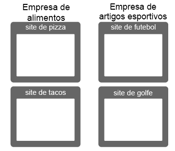
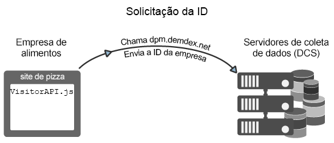
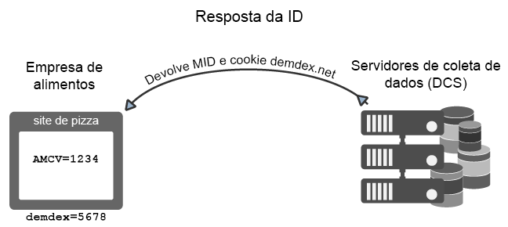
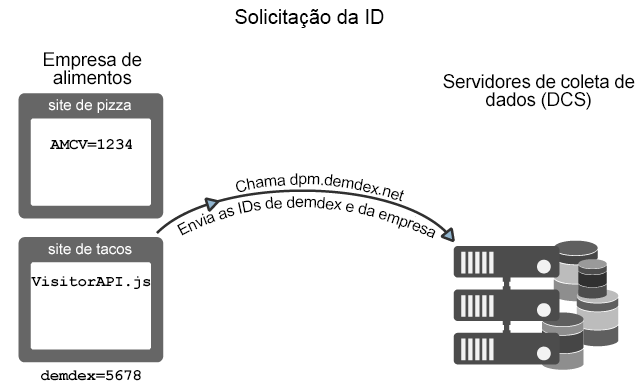
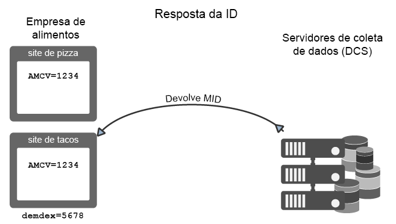
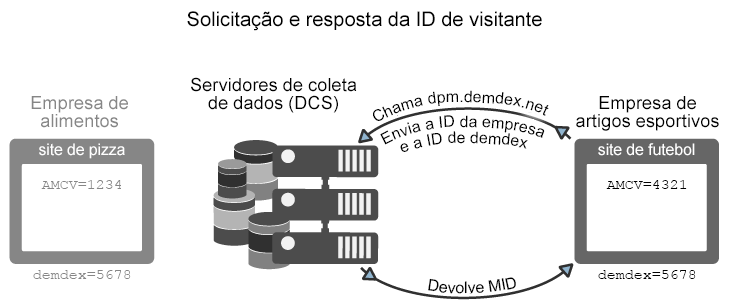

# Como o serviço de ID de visitante da Adobe solicita e define IDs{#how-the-experience-cloud-id-service-requests-and-sets-ids}

Uma visão geral da solicitação de ID e do processo de resposta. Esses exemplos cobrem a atribuição de ID em sites individuais, em sites diferentes e para sites gerenciados por clientes do CX Enterprise com suas próprias IDs da organização IMS.

>[!NOTE]
>
>Se não estiver familiarizado com a forma como o Serviço de ID de visitante cria a ID de visitante, consulte [Cookies e o Serviço de ID de visitante](../introduction/cookies.md).

## Solicitar uma ECID {#section-0b5e261fbd0547d9b9a1680e5ce536cc}

Os exemplos a seguir demonstram como o Serviço de ID de visitante solicita e recebe a ECID. Esses exemplos usam duas empresas fictícias, a Food Company e a Sports Company, para demonstrar os fluxos de dados das solicitações e respostas da ID. Cada empresa tem uma ID organizacional IMS exclusiva e implementou o código do Serviço de ID de visitante em todos os sites. Esses casos de uso representam fluxos de dados para uma implementação genérica do Serviço de ID de visitante sem o Analytics, IDs herdadas ou navegadores que bloqueiam cookies de terceiros.

**Primeira solicitação**

Neste exemplo, um novo visitante chega ao site de pizza gerenciado pela Food Company. A Food Company tem o código do Serviço de ID de visitante no site de pizza. Quando o site de pizza é carregado, o código do Serviço de ID de visitante verifica o cookie AMCV no domínio do site de pizza.

* Se o cookie AMCV estiver definido, o visitante do site terá uma ECID. Nesse caso, o cookie rastreia o visitante e compartilha dados com outras soluções da CX Enterprise.
* Se o cookie AMCV não foi definido, o código do Serviço de ID de visitante chama um [servidor de coleta de dados](https://experienceleague.adobe.com/docs/analytics/technotes/rdc/regional-data-collection.html?lang=pt-BR) (DCS) regional em `dpm.demdex.net/id` (consulte também [Compreender as chamadas para o domínio Demdex](https://experienceleague.adobe.com/docs/audience-manager/user-guide/reference/demdex-calls.html?lang=pt-BR). A chamada inclui a ID da organização IMS da Food Company. A ID da Organização IMS está definida na função `Visitor.getInstance` do código do Serviço de ID de Visitante.

**Primeira resposta**

Na resposta, o DCS retorna a ECID e o cookie demdex. O código do Serviço de ID de visitante grava o valor MID no cookie AMCV. Por exemplo, digamos que o DCS retorne um valor MID de 1234. Ele estaria armazenado no cookie AMCV como `mid|1234` e definido no domínio principal do site de pizza. O cookie demdex também contém um identificador exclusivo (vamos chamá-lo de 5678). Este cookie é definido no domínio demdex.net de terceiros, que é separado do domínio do site de pizza.

Como você verá no próximo exemplo, a ID demdex e a ID da organização IMS permitem que o Serviço de ID de visitante crie e retorne a MID correta quando o visitante for para outro site pertencente à Food Company.

## Respostas e solicitações entre sites {#section-15ea880453af467abd2874b8b4ed6ee9}

Neste exemplo, nosso visitante da Food Company navega até o site de tacos do site de pizza. A Food Company tem o código do Serviço de ID de visitante no site de tacos. O visitante nunca esteve no site de tacos.

Dadas estas condições, não há cookie AMCV no site de tacos. Além disso, o Serviço de ID do visitante não pode usar o cookie AMCV definido no site de pizza porque ele é específico ao domínio de pizza. Como resultado, o Serviço de ID de visitante deve chamar o DCS para verificar e solicitar uma ID de visitante. Nesse caso, a chamada DCS inclui a ID da organização IMS da Food Company *e* a ID demdex. E lembre-se, a ID demdex é retirada do site de pizza e armazenada como um cookie de terceiros sob o domínio demdex.net.

Depois que o DCS recebe a ID da organização IMS e a ID demdex, ele cria e retorna a MID correta para o visitante do site. Como a é derivada matematicamente da ID da organização IMS e da ID demdex, o cookie AMCV contém o valor da MID `mid = 1234`.

## Solicitações de ID de outros sites {#section-ba9a929e50d64b0aba080630fd83b6f1}

Neste exemplo, nosso visitante deixa os sites da Food Company e navega até o site de futebol pertencente à Sports Company. Quando o visitante chega ao site de futebol, o processo de solicitação e verificação de ID funciona da mesma forma descrita nos exemplos anteriores. No entanto, como a Sports Company tem sua própria ID de organização IMS, o serviço de ID de visitante retorna uma MID diferente. A nova MID é exclusiva aos domínios controlados pela Sports Company e permite que a empresa rastreie e compartilhe os dados do visitante nas soluções da CX Enterprise. A ID demdex permanece a mesma para esse visitante porque ela está contida no cookie de terceiros e continua por diferentes domínios.

