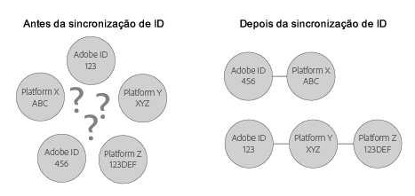

# Como entender a sincronização de ID e taxas de correspondência{#understanding-id-synchronization-and-match-rates}

Uma visão geral dos processos de sincronização de ID e taxas de correspondência no Serviço de identidade da plataforma Experience Platform, incluindo o Adobe Media Optimizer e o serviço de ID.

## Sincronização de ID e taxas de correspondência {#section-f652aae7234945e89d26dd833c5215fb}

A sincronização de ID relaciona IDs atribuídas pelo serviço de ID para IDs atribuídas aos visitantes do site pelos clientes. Por exemplo, considere que o serviço de ID atribuiu a ID de visitante 1234. Outra plataforma conhece o visitante pela ID 4321. O serviço de ID mapeia as IDs durante o processo de sincronização. Os resultados adicionam novos pontos de dados ao que os clientes conhecem sobre os visitantes do site. Além disso, se o serviço de ID não relacionar uma ID, ele cria uma nova e a usa para sincronizações futuras.

As taxas de correspondência avaliam e validam a eficácia do processo de sincronização de ID. As altas taxas de correspondência sugerem que um serviço específico será mais eficaz e fornecerá acesso a um público-alvo online maior do que um serviço com taxas de correspondência menores. A comparação entre taxas de correspondência é uma maneira quantificável de avaliar diferentes plataformas de anúncio integradas.



**Garantia de altas taxas de correspondência**

Para gerar altas taxas de correspondência, é importante configurar o serviço de ID corretamente (consulte o guia de implementação [padrão](../implementation-guides/standard.md#concept-89cd0199a9634fc48644f2d61e3d2445)). Uma implementação adequada ajuda a garantir altas taxas de correspondência, pois permite que o serviço de ID defina os cookies necessários para funcionar e sincronizar as IDs com parceiros de dados ativados. Entretanto, fatores como conexões lentas à Internet, coleta de dados de dispositivos móveis ou redes sem fio podem afetar o desempenho de coleta, sincronização e correspondência de IDs do serviço de ID. Essas variáveis do cliente estão além do controle do serviço de ID ou da [!DNL Adobe].

## Processo de sincronização de ID descrito {#section-a541a85cbbc74f5682824b1a2ee2a657}

O serviço de ID sincroniza as IDs em tempo real. Esse processo funciona no navegador em vez de uma transferência de dados de servidor para servidor. A tabela a seguir descreve as etapas no processo de sincronização de ID.

**Etapa 1: Carregar página**

Quando um visitante chega ao seu site e carrega uma página, a `Visitor.getInstance` função faz uma [chamada CORS](../reference/cors.md#concept-6c280446990d46d88ba9da15d2dcc758) ou JSON-P para o serviço de ID. O serviço de ID responde com um cookie que inclui a [!DNL Experience Cloud] ID (MID) do visitante. A MID é uma ID exclusiva atribuída a cada visitante do site. Consulte também a seção [Cookies e o Serviço de identidade da plataforma Experience Platform](../introduction/cookies.md).

**Etapa 2: carregar iFrame**

Enquanto o corpo da página é carregado, o serviço de ID carrega um iFrame chamado de *`Destination Publishing iFrame`*. [!DNL Destination Publishing iFrame] As cargas em um domínio separado da página principal. Esse design ajuda a garantir o desempenho da página e a melhorar a segurança, pois o iFrame:

* É carregado de modo assíncrono em relação à página pai. Isso significa que a página pai pode ser carregada independentemente do [!DNL Destination Publishing iFrame]. O carregamento do iFrame e dos pixels de sincronização de ID no iFrame não afeta a página pai ou a experiência do usuário.
* Carrega o mais rápido possível. Se for muito rápido, é possível carregar o iFrame depois do evento de carregamento de janela (não recomendado). Consulte [idSyncAttachIframeOnWindowLoad](../library/function-vars/idsyncattachiframeonwindowload.md#reference-b86b7112e0814a4c82c4e24c158508f4) para obter mais detalhes.
* Impede que o código no iFrame acesse ou afete a página pai.

Consulte também a seção [Como o serviço de identidade da plataforma Experiência solicita e define IDs….](../introduction/id-request.md#concept-2caacebb1d244402816760e9b8bcef6a)

**Etapa 3: acionar sincronizações de ID**

A sincronização de ID é um URL acionado no iFrame de publicação de destino. Como mostrado no exemplo genérico, um URL de sincronização de ID contém o ponto de extremidade de sincronização de ID do parceiro e um URL de redirecionamento, ou seja, um redirecionamento para a [!DNL Adobe] que inclui a ID.

```
http://abc.com?partner_id=abc&sync_id=123&redir=http://dpm.demdex.net/ibs:dpid=<
<varname>
  ADOBE_PARTNER_ID
</varname>>&dpuuid=<
<varname>
  PARTNER_UUID
</varname>>
```

Consulte também, [Sincronização de ID para transferências de dados de entrada](https://marketing.adobe.com/resources/help/en_US/aam/c_id_sync_in.html).

**Etapa 4: armazenamento de IDs**

IDs sincronizadas são armazenadas nos [servidores de borda e dados principais](https://marketing.adobe.com/resources/help/en_US/aam/c_compedge.html).

## Os serviços de sincronização gerencia sincronização de ID {#section-cd5784d7ad404a24aa28ad4816a0119a}

O termo *`Sync Services`* se refere às [!DNL Experience Cloud] tecnologias internas responsáveis pela sincronização de ID. Esse serviço está ativado por padrão. Para desativá-lo, adicione uma [variável opcional](../library/function-vars/disableidsync.md#reference-589d6b489ac64eddb5a7ff758945e414) à função `Visitor.getInstance` do serviço de ID. Os Serviços de sincronização correspondem [!DNL Experience Cloud] diferentes IDs como:

* IDs [!DNL Experience Cloud] de cookie de terceiros para [!DNL Experience Cloud] IDs primárias.

* IDs de [!DNL Experience Cloud] cookie primários para [!DNL Adobe Media Optimizer] IDs (AMO).

* IDs de cookies de terceiros da [!DNL Experience Cloud] para provedores de dados de terceiros e IDs da plataforma de direcionamento. Isso inclui serviços e plataformas, como provedores de dados, plataformas sob demanda e/ou de suprimento, redes de anúncios, trocas etc.
* IDs [!DNL Experience Cloud] de cookies primários para IDs de parceiros entre dispositivos.

## Sincronização de ID com o Adobe Media Optimizer {#section-642c885ea65d45ffb761f78838735016}

[!DNL Adobe Media Optimizer] é uma exceção ao processo de sincronização de ID com base em quadros. Como [!DNL Media Optimizer] é um domínio confiável, as sincronizações de ID ocorrem da página pai e não da [!DNL Destination Publishing iFrame]página. Durante a sincronização, o serviço de ID chama [!DNL Media Optimizer] , `cm.eversttech.net`que é um nome de domínio herdado usado [!DNL Media Optimizer] antes da aquisição da Adobe. O envio de dados para o [!DNL Media Optimizer] ajuda a melhorar as taxas de correspondência e é automático para clientes do serviço de ID que usam a versão 2.0 (ou posterior). Consulte também, [Cookies do Media Optimizer](https://marketing.adobe.com/resources/help/en_US/whitepapers/cookies/cookies_media_optimizer.html).

>[!MORE_ LIKE_ THIS]
>
>* [Compreender as chamadas ao domínio Demdex](https://marketing.adobe.com/resources/help/en_US/aam/demdex-calls.html)

