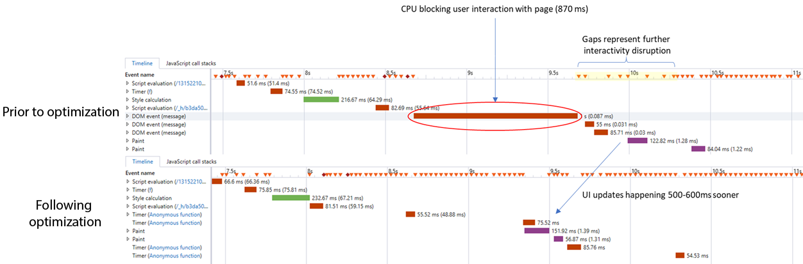

# Perguntas frequentes do serviço de ID{#id-service-faqs}

Perguntas frequentes sobre recursos, funcionalidades e problemas relacionados ao uso do serviço de ID.

## Recurso {#section-659e89f8b9a74cb8afff35587dc96836}

**Qual tipo de funcionalidade ou capacidade o serviço de ID fornece?**

Consulte a [Visão geral](../mcvid-introduction/mcvid-overview.md).

**Por que o serviço de ID não faz uma chamada para recuperar a Experience Cloud ID?**

Esse pode ser um problema difícil de diagnosticar. Você pode verificar os cabeçalhos da política de segurança do conteúdo do seu site. Caso tenha uma política de segurança estrita, essas configurações podem bloquear as chamadas de terceiros efetuadas pelo serviço de ID. Consulte [Políticas de segurança de conteúdo e o serviço da Experience Cloud ID](../mcvid-reference/mcvid-csp.md#concept-968c423a7392479db0a0d821ae9783e3).

**Armazenamento do arquivo VisitorAPI.js**

Você pode ter problemas se hospedar o arquivo VisitorAPI.js como um arquivo local em aplicativos para dispositivos móveis. Recomendamos hospedar o arquivo em um servidor da web.

## Tempo de carregamento de página e latência {#section-c78e148d8dbe4c77a436ef0f2af5434b}

**Como a biblioteca VisitorAPI.js do serviço de ID afeta o tempo de carregamento da página?**

Coloque a biblioteca visitorapi. js na parte superior da página na `<head>` seção do seu código. Isso ajuda a garantir que a chamada de uma ID sai antes do corpo da página começar a carregar e maximiza a probabilidade da ID ser retornada com sucesso.

A chamada do serviço de ID é assíncrona e é a única para o [domínio demdex.net](https://marketing.adobe.com/resources/help/en_US/aam/demdex-calls.html). A chamada do serviço de ID não impede o carregamento de outros elementos na página.

Para [!DNL Target] clientes, colocar o código de serviço de ID na `<body>` página pode aumentar a probabilidade de que ele possa bloquear uma [!DNL Target] chamada. Se você precisar colocar o código de serviço de ID no corpo da página, ele deverá ser colocado após a `<body>` tag aberta.

**O serviço de ID faz uma chamada de servidor a cada carregamento de página?**

Não, essa chamada ocorre somente na primeira vez que a página é renderizada e uma vez a cada sete dias depois. Enquanto isso, as chamadas de servidor não são obrigatórias. O serviço de ID opera no modo do lado do cliente e não precisa fazer uma chamada do servidor para retornar uma ID.

Consulte [Visão geral](../mcvid-introduction/mcvid-overview.md).

**Ao usar o serviço de ID, o que pode causar um tempo de carregamento de página mais lento ou afetar a experiência do usuário?**

É difícil catalogar todas as condições possíveis. Bilhões de clientes se conectam aos nossos serviços e a grande variedade de possíveis locais e formas de conexão afeta o desempenho. Por exemplo:

* A velocidade varia consideravelmente em redes móveis. Essas redes também sofrem devido à perda de sinal e dos pacotes de dados ou voz.
* A conectividade encontra problemas em dispositivos que se conectam por Wi-Fi sob diversas condições. Por exemplo, a perda de pacotes e os problemas de velocidade são comuns em locais públicos como cafés ou em outros ambientes, como aeronaves em que os pacotes devem passar por satélite antes de chegar às redes terrestres.
* As redes locais configuradas incorretamente podem afetar negativamente a conectividade e a velocidade.
* Os dispositivos do cliente podem ter seus próprios problemas, como memória baixa, permutação excessiva de discos ou capacidade limitada da CPU em relação às cargas de trabalho atuais.
* Os navegadores consultam e executam chamadas de servidor remotas e processam as respostas com regras diferentes, dependendo do fabricante e da versão do navegador. Esse comportamento afeta a velocidade e o desempenho.

**Você consegue informar alguns aprimoramentos efetuados para reduzir o tempo de carregamento da página?**

Por exemplo, a concessão de encadeamento. Apresentamos a concessão de encadeamento no caso de diversas solicitações de sincronização de ID. Observamos pelos relatórios de laboratório que para clientes executando diversas sincronizações de ID, a interface do usuário ficava bloqueada devido a muitos cálculos contínuos da CPU. Como resultado, apresentamos a concessão de encadeamento para separar as solicitações de sincronização de ID por 100 ms cada.

Essa alteração aprimora o desempenho para clientes usando Visitor 2.3.0+ e DIL 6.10+. Os aprimoramentos no tempo de carregamento da página são exibidos na figura abaixo:

**As solicitações do navegador usando CORS em comparação a JSONP afetam o desempenho da página?**

Em geral, as solicitações de recursos com CORS são preferenciais em relação a JSONP. Com JSONP, alguns navegadores consultam e despriorizam as solicitações em relação a outras chamadas síncronas e assíncronas na página. O CORS ajuda a garantir que essas solicitações sejam tratadas com uma prioridade mais alta na pilha de chamadas do navegador.

Consulte [Suporte para CORS no serviço de Experience Cloud ID](../mcvid-reference/mcvid-cors.md#concept-6c280446990d46d88ba9da15d2dcc758).

## Segurança {#section-b176b8492fbe4acfb79ebb30ec902f98}

**O serviço de ID oferece suporte ao CORS?**

Sim. Consulte [Suporte CORS no serviço da Experience Cloud ID](../mcvid-reference/mcvid-cors.md#concept-6c280446990d46d88ba9da15d2dcc758).

**O que é o CORS?**

*`Cross-Origin Resource Sharing`* ou CORS, é um método que os navegadores usam para solicitar recursos. O serviço de ID sempre solicita recursos usando CORS em navegadores compatíveis. O serviço de ID solicita recursos com JSONP em navegadores antigos que não oferecem suporte ao CORS. Consulte [Experience Cloud](../mcvid-reference/mcvid-cors.md#concept-6c280446990d46d88ba9da15d2dcc758).

**O que acontece se meus requisitos de segurança são estritos demais e eu desejar não usar JSONP?**

Se você tiver requisitos de segurança estritos, defina a configuração da API do serviço de ID como `useCORSOnly: true`. Esse modo deve ser habilitado somente se você tiver certeza de que os visitantes usam navegadores com suporte para CORS.

Consulte [Experience Cloud](../mcvid-reference/mcvid-cors.md#concept-6c280446990d46d88ba9da15d2dcc758) e [usecorsonly](../mcvid-library/mcvid-function-vars/mcvid-use-cors-only.md#reference-8a9a143d838b48d6b23329b84b13e1fa).

>[!MORE_ LIKE_ THIS]
>
>* [Atendimento ao cliente](https://helpx.adobe.com/marketing-cloud/contact-support.html)

