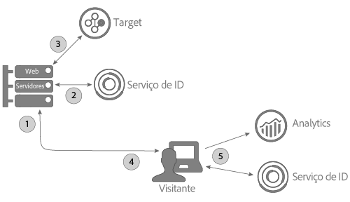
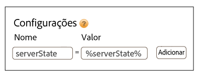

# Uso do serviço de ID com A 4 T e implementação do lado do servidor do Target {#using-the-id-service-with-a-t-and-a-server-side-implementation-of-target}

Essas instruções se aplicam aos clientes da A4T com implementações mistas de servidor e cliente para o Target, o Analytics e o serviço de ID. Os clientes que precisam executar o serviço de ID em um ambiente NodeJS ou Rhino também devem consultar essas informações. Essa instância do serviço de ID usa uma versão reduzida da biblioteca de códigos VisitorAPI.js, que você pode baixar e instalar no NPM (Node Package Manager, Gerenciador de pacote de nós). Consulte esta seção para obter instruções de instalação e outros requisitos de configuração.

## Introdução {#section-ab0521ff5bbd44c592c3eaab31c1de8b}

A A4T (e outros clientes) pode usar essa versão do serviço de ID quando precisam:

* Renderizar conteúdo de página da Web nos servidores e passá-lo para um navegador para exibição final.
* Faça [!DNL Target] chamadas do servidor.
* Efetuar chamadas do cliente (no navegador) para o [!DNL Analytics].
* Sincronizar IDs separadas do [!DNL Target] e do [!DNL Analytics] para determinar se um visitante visualizado por uma solução é a mesma pessoa visualizada por outra solução.

## Download de código e interfaces fornecidas {#section-32d75561438b4c3dba8861be6557be8a}

Consulte o [repositório NPM do serviço de ID](https://www.npmjs.com/package/@adobe-mcid/visitor-js-server) para baixar o pacote de códigos do servidor e consultar as interfaces incluídas na versão atual.

## Fluxo de trabalho {#section-56b01017922046ed96536404239a272b}

O diagrama e as seções abaixo descrevem o que ocorre e o que é necessário configurar em cada etapa do processo de implementação do servidor.



## Etapa 1: Solicitar página {#section-c12e82633bc94e8b8a65747115d0dda8}

A atividade do servidor começa quando um visitante faz uma solicitação HTTP para carregar uma página da Web. Durante essa etapa, o servidor recebe essa solicitação e verifica o [cookie AMCV](../mcvid-introduction/mcvid-cookies.md). O cookie AMCV contém [!DNL Experience Cloud] a ID do visitante (MID).

## Etapa 2: Gerar carga do serviço de ID {#section-c86531863db24bd9a5b761c1a2e0d964}

Em seguida, você precisa criar um servidor *`payload request`* para o serviço de ID. Uma solicitação de carga:

* Passa o cookie AMCV para o serviço de ID.
* Solicita dados exigidos pelo Target e Analytics em etapas subsequentes descritas abaixo.

>[!NOTE]
>
>Este método solicita uma única mbox do [!DNL Target]. Se for necessário solicitar diversas mboxes em uma única chamada, consulte [generateBatchPayload](https://www.npmjs.com/package/@adobe-mcid/visitor-js-server#generatebatchpayload).

A solicitação de carga deve ser semelhante ao seguinte exemplo de código. No exemplo de código, a função `visitor.setCustomerIDs` é opcional. Consulte [IDs do cliente e Estados de autenticação](../mcvid-reference/mcvid-authenticated-state.md) para obter mais informações.

```js
//Import the ID service server package 
var Visitor = require("@adobe-mcid/visitor-js-server"); 
 
//Pass in your Organization ID to instantiate Visitor 
var visitor = new Visitor("Insert Experience Cloud ID here"); 
 
// 
<i>(Optional)</i> Set a custom customer ID 
visitor.setCustomerIDs({ 
     userid:{ 
          id:"1234", 
          authState: Visitor.AuthState.UNKNOWN //AuthState is a static property of the Visitor class 
     } 
}); 
 
//Parse the visitor's HTTP request for the AMCV cookie 
var cookies = cookie.parse(req.headers.cookie || ""); 
var cookieName = visitor.getCookieName(); // Visitor API that returns the cookie name. 
var amcvCookie = cookies[cookieName]; 
 
//Generate the payload request pass your mbox name and the AMCV cookie if present 
var visitorPayload = visitor.generatePayload({ 
     mboxName: "bottom-banner-mbox", 
     amcvCookie: amcvCookie 
});
```

O serviço de ID retorna a carga em um objeto JSON semelhante ao seguinte exemplo. Os dados de carga são exigidos pelo [!DNL Target].

```js
{ 
    "marketingCloudVisitorId": "02111696918527575543455026275721941645", 
    "mboxParameters": { 
        "mboxAAMB": "abcd1234", 
        "mboxMCGLH": "9", 
        "mboxMCSDID": "56BE026543F7E211-1CC51BCAAE88F0D2", 
        "vst.userid.id": "1234567890", 
        "vst.userid.authState": 0 
    } 
}
```

Se o visitante não tiver um cookie AMCV, a carga omite os pares de valores chave abaixo:

* `marketingCloudvisitorId`
* `mboxAAMB`
* `mboxMCGLH`

## Etapa 3: Adicionar carga à chamada do Target {#section-62451aa70d2f44ceb9fd0dc2d4f780f7}

Depois que o servidor receber dados de carga do serviço de ID, é necessário instanciar mais códigos para mesclá-los aos dados passados ao [!DNL Target]. O objeto JSON final passado para o [!DNL Target] deve ser semelhante a:

```js
{ 
"mbox" : "target-global-mbox", 
"marketingCloudVisitorId":"02111696918527575543455026275721941645", 
"requestLocation" : { 
     "pageURL" : "http://www.domain.com/test/demo.html", 
     "host" : "localhost:3000" 
     }, 
"mboxParameters" : { 
     "mboxAAMB" : "abcd1234", 
     "mboxMCGLH" : "9", 
     "mboxMCSDID": "56BE026543F7E211-1CC51BCAAE88F0D2", 
     "vst.userid.id": "1234567890", 
     "vst.userid.authState": 0, 
     } 
} 
```

## Etapa 4: Obter estado do servidor para o serviço de ID {#section-8ebfd177d42941c1893bfdde6e514280}

Os dados do estado do servidor contêm informações sobre o trabalho executado no servidor. O código do serviço de ID do cliente exige essas informações. Os clientes que implementaram o serviço de ID ( [!DNL Dynamic Tag Manager] DTM) podem configurar o DTM para passar dados de estado do servidor por meio dessa ferramenta. Se você configurou o serviço de ID por um processo não padrão, é necessário retornar o estado do servidor com seu próprio código. O serviço de ID do cliente e o código do [!DNL Analytics] passam dados de estado para a Adobe quando a página é carregada.

**Obter estado do servidor por meio do DTM**

Se você implementou o serviço de ID no DTM, é necessário adicionar código à página e especificar um par de valores de nome nas configurações do DTM.

**Código da Página**

Adicione esse código à `<head>` tag da sua página HTML:

```js
//Get server state 
var serverState = visitor.getState(); 
 
Response.send(" 
... 
<head> 
     <script> 
          //Add 'serverState' as a stringified JSON global variable. 
          "var serverState = "+ JSON.stringify(serverState) +";  
     </script> 
     <script src = "DTM script (satellite JS)"> 
     </script> 
</head> 
...
```

**Configurações do DTM**

Adicione esses pares de valor de nome à seção **[!UICONTROL Geral &gt; Configurações]da instância do serviço de ID:**

* **[!UICONTROL Nome:]** serverState
* **[!UICONTROL Valor:]** %serverState%

   >[!IMPORTANT]
   >
   >O nome do valor deve corresponder ao nome da variável definido `serverState` no código da página.

As configurações definidas devem ser:



Consulte também a seção [Configurações do serviço da Experience Cloud ID para DTM](../mcvid-implementation-guides/mcvid-standard.md#concept-fb6cb6a0e6cc4f10b92371f8671f6b59).

**Obter estado do servidor sem DTM**

Se você tem uma implementação não padrão do serviço de ID, é necessário configurar esse código para funcionar no servidor enquanto monta a página solicitada:

```js
//Get server state 
var serverState = visitor.getState(); 
 
Response.send(" 
... 
<head> 
     <script src="VisitorAPI.js"></script> 
     <script> 
          var visitor = Visitor.getInstance(orgID, { 
          serverState: serverState  
          ... 
     </script> 
</head> 
...
```

## Etapa 5: Forneça uma página e retorne os dados da Experience Cloud {#section-4b5631a0d75a41febd6f43f8c214c263}

Nesse ponto, o servidor da Web envia conteúdo da página para o navegador do visitante. A partir desse ponto, o navegador (e não o servidor) efetua as chamadas restantes do serviço de ID e do [!DNL Analytics]. Por exemplo, no navegador:

* O serviço de ID recebe dados do estado do servidor e passa a SDID para o AppMeasurement.
* O AppMeasurement envia dados sobre a ocorrência da página para o [!DNL Analytics], incluindo a SDID.
* [!DNL Analytics] e [!DNL Target] compare sdids para este visitante. Com uma SDID idêntica, o [!DNL Target] e o [!DNL Analytics] unem a chamada do servidor e do cliente. Nesse momento, ambas as soluções agora reconhecem o visitante como a mesma pessoa.

>[!MORE_ LIKE_ THIS]
>
>* [Pacote do serviço de ID do servidor do Gerenciador de pacote de nós](https://www.npmjs.com/package/@adobe-mcid/visitor-js-server)

