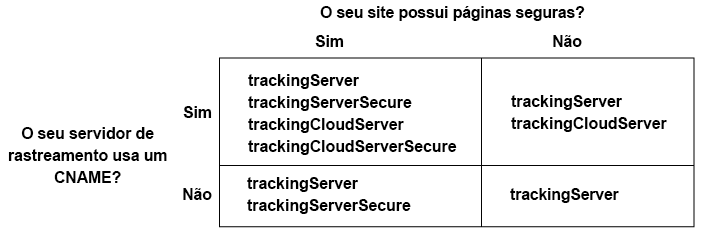

# Implementar o serviço da Experience Cloud ID para o Analytics, o Audience Manager e o Target {#implement-the-experience-cloud-id-service-for-analytics-audience-manager-and-target}

Essas instruções se destinam aos clientes do Analytics, Audience Manager e Target que desejam usar o serviço da Experience Cloud ID e não usam o Dynamic Tag Management (DTM). Entretanto, recomendamos que você use o DTM para implementar o serviço de ID. O DTM simplifica o fluxo de trabalho de implementação, além de garantir automaticamente a inserção e o sequenciamento correto do código.

>[!IMPORTANT]
>
>Leia os requisitos do serviço [de ID](../mcvid-reference/mcvid-requirements.md) antes de começar e observe os seguintes requisitos específicos desta implementação: &gt;
>* Os clientes que usam s_code não podem concluir esse procedimento. Atualize para o código mbox v61 a fim de concluir o procedimento.
>* Configure e teste esse código em um ambiente de desenvolvimento *antes* de implementá-lo na produção.
>


## Etapa 1: Planejamento do encaminhamento pelo lado do servidor {#section-880797cc992d4755b29cada7b831f1fc}

Além das etapas descritas, os clientes que usam o [!DNL Analytics] e o [!DNL Audience Manager] devem migrar para o encaminhamento do servidor. O encaminhamento do servidor permite a remoção do DIL (código de coleta de dados do Audience Manager) e a substituição pelo [Módulo de gerenciamento de público-alvo](https://marketing.adobe.com/resources/help/en_US/aam/c_profiles_audiences.html). Consulte a [documentação de encaminhamento do servidor](https://marketing.adobe.com/resources/help/en_US/reference/ssf.html) para obter mais informações.

A migração para o encaminhamento do servidor requer planejamento e coordenação. Esse processo envolve mudanças externas do código do site e das etapas internas que a Adobe deve executar para provisionar sua conta. Na verdade, muitos desses procedimentos de migração devem ocorrer simultaneamente e ser lançados juntos. O caminho de implementação deve seguir esta sequência de eventos:

1. Trabalhe com os contatos do [!DNL Analytics] e do [!DNL Audience Manager] a fim de planejar a migração do serviço de ID e do encaminhamento do servidor. A seleção do servidor de rastreamento é uma parte importante do plano.

1. For provisionado [!DNL Profiles & Audiences]. Preencha o formulário no [site de integrações e provisionamento](https://adobe.allegiancetech.com/cgi-bin/qwebcorporate.dll?idx=X8SVES) para começar.

1. Implemente o serviço de ID e [!DNL Audience Management Module] ao mesmo tempo. Para funcionar adequadamente, o [!DNL Audience Management Module] (encaminhamento pelo lado do servidor) e o serviço de ID devem ser lançados para o mesmo conjunto de páginas e ao mesmo tempo.

## Etapa 2: Baixar o código do serviço de ID {#section-0780126cf43e4ad9b6fc5fe17bb3ef86}

O serviço de ID exige a biblioteca de código `VisitorAPI.js`. Para baixar a biblioteca de código:

1. Acesse **[!UICONTROL Administração &gt; Gerenciamento de código]**.
1. No Gerenciamento de código, clique em **[!UICONTROL JavaScript (Novo)]** ou **[!UICONTROL JavaScript (Herdado)]**. As bibliotecas de código comprimidas serão baixadas.

1. Descomprima o arquivo de código e abra o arquivo `VisitorAPI.js`.

## Etapa 3: Adicionar a função Visitor. getinstance ao código do serviço de ID {#section-9e30838b4d0741658a7a492153c49f27}

>[!IMPORTANT]
>
>* as versões anteriores da API do serviço de ID colocavam essa função em um local diferente e exigiam uma sintaxe diferente. Caso esteja migrando de uma versão anterior para a [versão 1.4](../mcvid-release-notes/mcvid-notes-2015.md#section-f5c596f355b14da28f45c798df513572), observe a nova disposição e sintaxe documentadas aqui.
>* O código em MAIÚSCULA é um espaço reservado para valores. Substitua o texto pela ID da organização, pelo URL do servidor de rastreamento ou outro valor nomeado.
>


**Parte 1: copiar a função Visitor.getInstance abaixo**

```js
var visitor = Visitor.getInstance("INSERT-MARKETING-CLOUD-ORGANIZATION ID-HERE", { 
     trackingServer: "INSERT-TRACKING-SERVER-HERE", // same as s.trackingServer 
     trackingServerSecure: "INSERT-SECURE-TRACKING-SERVER-HERE", // same as s.trackingServerSecure 
 
     // To enable CNAME support, add the following configuration variables 
     // If you are not using CNAME, DO NOT include these variables 
     marketingCloudServer: "INSERT-TRACKING-SERVER-HERE", 
     marketingCloudServerSecure: "INSERT-SECURE-TRACKING-SERVER-HERE" // same as s.trackingServerSecure 
}); 
```

**Parte 2: adicionar código de função ao arquivo API.js do visitante**

Insira a função `Visitor.getInstance` ao final do arquivo, após o bloqueio do código. O arquivo editado deve ficar parecido com o exemplo abaixo:

```js
/* 
========== DO NOT ALTER ANYTHING BELOW THIS LINE ========== 
Version and copyright section 
*/ 
 
// Visitor API code library section 
 
// Put Visitor.getInstance at the end of the file, after the code library 
 
var visitor = Visitor.getInstance("INSERT-MARKETING-CLOUD-ORGANIZATION ID-HERE", { 
     trackingServer: "INSERT-TRACKING-SERVER-HERE", // same as s.trackingServer 
     trackingServerSecure: "INSERT-SECURE-TRACKING-SERVER-HERE", // same as s.trackingServerSecure 
 
     // To enable CNAME support, add the following configuration variables 
     // If you are not using CNAME, DO NOT include these variables 
     marketingCloudServer: "INSERT-TRACKING-SERVER-HERE", 
     marketingCloudServerSecure: "INSERT-SECURE-TRACKING-SERVER-HERE" // same as s.trackingServerSecure 
}); 
```

## Etapa 4: Adicionar a ID de empresa da Experience Cloud à Visitor. getinstance {#section-e2947313492546789b0c3b2fc3e897d8}

Na `Visitor.getInstance` função, substitua `INSERT-MARKETING-CLOUD-ORGANIZATION ID-HERE` com sua ID de empresa da Experience Cloud. Caso não saiba a ID da organização, é possível encontrá-la na página de administração da Experience Cloud. A função editada pode ser parecida com o exemplo abaixo.

`var visitor = Visitor.getInstance("1234567ABC@AdobeOrg", { ...`

>[!IMPORTANT]
>
>*Não* altere o caso dos caracteres na ID da empresa. A ID diferencia maiúsculas e minúsculas e deve ser usada exatamente como foi fornecida.

## Etapa 5: Adicionar seus servidores de rastreamento a Visitor. getinstance {#section-0dfc52096ac2427f86045aab9a0e0dfc}

O Analytics usa servidores de rastreamento para a coleta de dados.

**Parte 1: encontrar os URLs do servidor de rastreamento**

Verifique os `s_code.js` urls do servidor `AppMeasurement.js` de rastreamento para encontrar os urls do servidor de rastreamento. Os URLs devem ser especificados pelas variáveis:

* `s.trackingServer`
* `s.trackingServerSecure`

**Parte 2: definir as variáveis do servidor de rastreamento**

Para determinar quais variáveis do servidor de rastreamento usar:

1. Responda às perguntas da matriz de decisão abaixo. Use as variáveis que correspondem às suas respostas.
1. Substitua os marcadores de posição com os URLs do servidor de rastreamento.
1. Remova o servidor de rastreamento não usado e as variáveis do servidor da Experience Cloud do código.



>[!NOTE]
>
>Quando usada, corresponda os urls do servidor da Experience Cloud aos urls do servidor de rastreamento correspondentes como este:

* URL do servidor da Experience Cloud = URL do servidor de rastreamento
* URL seguro do servidor da Experience Cloud = URL seguro do servidor de rastreamento

Se você não tiver certeza sobre como encontrar o servidor de rastreamento, consulte as [Perguntas frequentes](../mcvid-faq-intro/mcvid-faq.md) e [Preenchimento correto das variáveis trackingServer e trackingServerSecure](https://helpx.adobe.com/analytics/kb/determining-data-center.html#).

## Etapa 6: Atualizar o arquivo appmeasurement. js {#section-5517e94a09bc44dfb492ebca14b43048}

Essa etapa requer [!DNL AppMeasurement]. Não é possível continuar se você estiver usando o s_code.

Adicione `Visitor.getInstance` a função mostrada abaixo ao `AppMeasurement.js` seu arquivo. Coloque-o na seção que contém configurações como `linkInternalFilters`, `charSet`etc `trackDownloads`.:

`s.visitor = Visitor.getInstance("INSERT-MARKETING-CLOUD-ORGANIZATION ID-HERE");`

>[!IMPORTANT]
>
>Nesse ponto, você deve remover o código [!DNL Audience Manager] DIL e substituí-lo pelo Módulo de gerenciamento de público-alvo. Consulte [Implementar o encaminhamento do servidor](https://marketing.adobe.com/resources/help/en_US/reference/ssf.html) para obter instruções.

***(Opcional, mas recomendado)*Criar um prop personalizado**

Definir um prop padrão em `AppMeasurement.js` para medir a cobertura. Adicione este prop personalizado à função `doPlugins` do arquivo `AppMeasurement.js`:

```js
// prop1 is used as an example only. Choose any available prop. 
s.prop1 = (typeof(Visitor) != "undefined" ? "VisitorAPI Present" : "VisitorAPI Missing");
```

## Etapa 7: Adicionar o código da API do visitante à página {#section-c2bd096a3e484872a72967b6468d3673}

Coloque o ` [!DNL VisitorAPI.js]` arquivo nas `<head>` tags em cada página. Ao anexar o arquivo `VisitorAPI.js` à página:

* Coloque-o no início da `<head>` seção a ele é exibido antes de outras tags de solução.
* É necessário executar antes do AppMeasurement e do código de outras soluções da [!DNL Experience Cloud].

## Etapa 8: (Opcional) Configurar um período de carência {#section-aceacdb7d5794f25ac6ff46f82e148e1}

Se algum desses casos de uso se aplicar à sua situação, peça [ao Atendimento ao cliente](https://helpx.adobe.com/marketing-cloud/contact-support.html) para configurar um período [de carência temporário](../mcvid-reference/mcvid-analytics-reference/mcvid-grace-period.md). Os períodos de carência podem durar até 180 dias. É possível renovar um período de carência, se necessário.

**Implementação parcial**

Se você possuir páginas que usam o serviço de ID e outras que não o usam, é necessário ter um período de carência para que todas sejam relatadas no mesmo conjunto de relatórios do Analytics. Isso é comum se você contar com um conjunto de relatórios globais que relatam entre domínios.

O período de carência será cancelado depois da implantação do serviço de ID em todas as suas páginas da Web que forem relatadas no mesmo conjunto de relatórios.

**Exigências do cookie s_vi**

É necessário ter um período de carência se os novos visitantes precisarem ter um cookie s_vi após migrarem para o serviço de ID. Isso é comum se a implementação ler o cookie s_vi e o armazenar em uma variável.

A descontinuação do período de carência após sua implementação pode capturar a MID em vez de ler o cookie s_vi.

Consulte também [Cookies e o serviço da Experience Cloud ID](../mcvid-introduction/mcvid-cookies.md).

**Integração de dados da sequência de cliques**

É necessário ter um período de carência caso envie dados para um sistema interno de um feed de dados de sequência de cliques que processe os usos das colunas `visid_high` e `visid_low`.

Descontinuar o período de carência após seu processo de ingestão de dados pode usar as `post_visid_high``post_visid_low` colunas.

Consulte também, [Referência da coluna de dados da sequência de cliques](https://marketing.adobe.com/resources/help/en_US/sc/clickstream/datafeeds_reference.html).

## Etapa 9: Teste e verifique {#section-f857542bfc70496dbb9f318d6b3ae110}

As soluções da [!DNL Experience Cloud] nesta implementação retornam IDs na forma de pares de valor chave. Cada solução usa chaves diferentes (por exemplo, a SDID do [!DNL Analytics] em comparação à mboxMCSDID do [!DNL Target]) para a mesma ID. Para testar a implementação, carregue as páginas em um ambiente de desenvolvimento. Use o console do navegador ou o software que monitora solicitações HTTP e respostas para verificar as IDs listadas abaixo. O serviço de ID está implementado corretamente quando os pares de valores chave listados abaixo retornam os mesmos valores da ID.

>[!TIP]
>
>Você pode usar o [Adobe Debugger](https://marketing.adobe.com/resources/help/en_US/sc/implement/?f=debugger.html) ou o proxy HTTP [Charles](https://www.charlesproxy.com/) para verificar essas IDs específicas da solução. Entretanto, você pode usar qualquer ferramenta ou depurador adequado para suas necessidades.

**Todas as soluções**

Verifique:

* [cookie AMCV](../mcvid-introduction/mcvid-cookies.md) no domínio em que a página está hospedada.
* [!DNL Experience Cloud] ID (MID) com o [!DNL Adobe] depurador ou a ferramenta de depuração preferencial.

Para obter verificações adicionais que ajudam a determinar se o serviço de ID está funcionando corretamente, consulte [Testar e verificar o serviço da Experience Cloud ID](../mcvid-implementation-guides/mcvid-test-verify.md).

**Analytics**

Verifique se o identificador SDID está na solicitação de JavaScript. A SDID do Analytics deve corresponder à mboxMCSDID do Target.

Se os testes retornarem uma AID, isso indica o seguinte:

* Você é um visitante constante no processo de migração de IDs herdadas do [!DNL Analytics].
* Há um período [de cortesia](../mcvid-reference/mcvid-analytics-reference/mcvid-grace-period.md) ativado.

Ao observar uma AID, compare o valor com a mboxMCAVID do [!DNL Target]. Esses valores são idênticos quando o serviço de ID é implementado corretamente.

**Audience Manager**

Para testar o encaminhamento do servidor, consulte:

* [Como determinar se a conta está pronta para receber dados encaminhados](https://marketing.adobe.com/resources/help/en_US/aam/ssf-success.html)
* [Como determinar se a conta não está pronta para receber dados encaminhados](https://marketing.adobe.com/resources/help/en_US/aam/ssf-fail.html)

**Target**

Verifique:

* mboxMCGVID
* mboxMCSDID (a mboxMCSDID deve corresponder à SDID do Analytics.)

Se os testes retornarem uma mboxMCAVID, isso indica o seguinte:

* Você é um visitante constante no processo de migração de IDs herdadas do [!DNL Analytics].
* O período de carência está habilitado.

Ao observar uma mboxMCAVID, compare o valor à AID do [!DNL Analytics]. Esses valores são idênticos quando o serviço de ID é implementado corretamente.

**Implantação**

## Etapa 10: Implantar {#section-4188fa95e7dc455a986b48a6c517c1c9}

Implanta o código após o teste.

Se você habilitou um período de carência:

* Garanta que a ID do Analytics e a MID estejam presentes na solicitação de imagem.
* Lembre-se de desabilitar o período de carência depois de atender aos [critérios de descontinuação](../mcvid-implementation-guides/mcvid-setup-aam-analytics-target.md#section-aceacdb7d5794f25ac6ff46f82e148e1).

